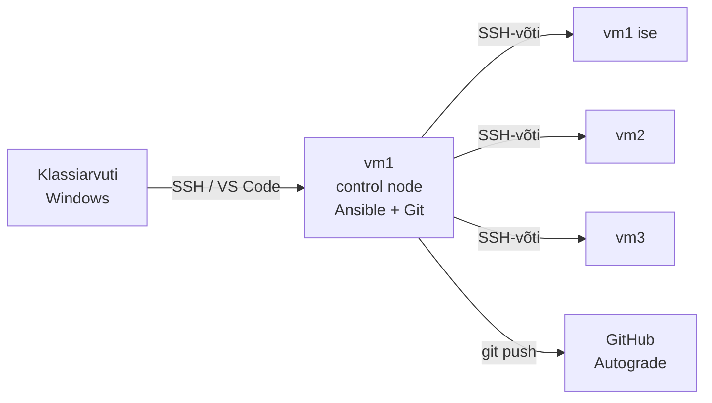

# K1 · Praktikum: esimene playbook

## Eesmärk

Tänase lõpuks on sul playbook, mis viib kolm serverit samasse olekusse: teenusekasutaja on olemas, nginx on paigaldatud ja käib, avaleht näitab serveri nime. Teine jooks ei muuda midagi (`changed=0`), ja see on tõend, et kirjeldus on idempotentne.



Praktikumil on kaks osa:

- A · Juhendatud: kõik ühel masinal (`localhost`), samm-sammult. Oodatava tulemuse näed iga sammu juures kokkuvolditud plokis: tee enne ise, siis võrdle.
- B · Iseseisev: sama oskus kolmel VM-il. Antud on eesmärk ja piirangud, lahenduse leiad ise. Vihjed on kinnistes plokkides.

| Samm | Tulemus | Kuidas kontrollid |
|---|---|---|
| Enne | Töökeskkond tehtud, repo kloonitud | `ansible --version`, `ls` repos |
| A1 | nginx käib käsitsi seadistatuna | `curl -s localhost` |
| A2 | skripti probleem on nähtav | `cat /srv/raport/conf` |
| A3 | Ansible leiab localhosti | `ansible kohalik -m ping` |
| A4–A5 | playbook töötab, teine jooks ei muuda midagi | `changed=0`, `logid/teine_jooks.txt` |
| A6–A8 | eelvaade, drift, muutujad | `--check --diff`, `curl` |
| B | kolm masinat samas olekus | `logid/kolm_masinat.txt`, `curl` iga IP-le |
| Esitamine | README täidetud, push tehtud | Autograde K1–K5 |

Loengu vastavad peatükid on iga sammu juures viidatud. Kui mõni mõiste on udune, ava [loeng](lecture.md) samal ajal teises aknas.

## Õpiväljundid

Praktikumi lõpuks oskad:

1. näidata oma masinas, miks toores skript pole idempotentne, ja asendada see playbookiga;
2. luua inventari ja ansible.cfg-i ning kasutada ad-hoc käske ja fakte;
3. kirjutada playbooki päris moodulitega ja tõestada idempotentsust `changed=0`-ga;
4. eelvaadata muudatust `--check --diff`-ga ja parandada drift'i;
5. seadistada võtmepõhise SSH ja rakendada sama playbooki kolmele masinale;
6. kasutada muutujaid ja fakte playbookis;
7. dokumenteerida töö README-s ja esitada see Giti kaudu.

---

## Enne alustamist

Kui sa pole seda veel teinud, tee läbi [Töökeskkond](../keskkond.md): ühendus vm1-ga, parooli vahetus ja masinate nimed, Ansible ja Git, SSH-võti ning repo kloonimine.

Selle praktikumi repo tekib Classroom 50 lingist, mille juhendaja jagab. Klooni see vm1-s SSH-ga (**Code** → **SSH**) ja tee kõik tänased failid selle juurkausta.

Kontrollnimekiri on su repos **Issues** all: issue Lab 01 · Esimene playbook.

- Märgi ruut, kui osa on tehtud. Sulge issue, kui kõik on tehtud.
- Sama issue on kursuse projektis: **Projects** → ITS-25 Automatiseerimine → **Minu tööd**.
- Kinni? Küsi Discordis või ava issue mallist **Vajan abi**.

Lõpuks on repos:

```
<sinu-repo>/
├── ansible.cfg
├── inventory.ini
├── bootstrap.yml
├── halb.sh
├── README.md
└── logid/
    ├── teine_jooks.txt
    └── kolm_masinat.txt
```

---

## A · Juhendatud osa

### A1 · Seadista nginx käsitsi

Selle sammu lõpuks käib vm1-s käsitsi seadistatud nginx ja `curl localhost` näitab sinu lehte.

```bash
sudo useradd -m saidi
sudo dnf install -y nginx
echo "<h1>Tere käsitsi</h1>" | sudo tee /usr/share/nginx/html/index.html
sudo systemctl enable --now nginx
```

??? note "Kontrolltabel: kuidas iga sammu kontrollida"

    Kirjuta iga käsu kohta rida: käsk, mis pidi tekkima, kuidas kontrollid. A4-s muutuvad need read playbooki task'ideks.

    | Käsk | Tulemus | Kontroll |
    |---|---|---|
    | `useradd -m saidi` | kasutaja `saidi` on olemas, kodukaust olemas | `id saidi`, `ls -d /home/saidi` |
    | `dnf install nginx` | pakett paigaldatud | `rpm -q nginx` |
    | `tee index.html` | avaleht sisuga | `cat /usr/share/nginx/html/index.html` |
    | `systemctl enable --now` | teenus käib ja käivitub buutimisel | `systemctl is-active nginx`, `systemctl is-enabled nginx` |

??? tip "Kui nginx ei käivitu või `curl` ei vasta"

    Vaata teenuse olekut ja logi:

    ```bash
    sudo systemctl status nginx
    sudo journalctl -u nginx -n 20
    sudo tail -n 20 /var/log/nginx/error.log
    ```

    `systemctl status` näitab, kas teenus käib ja viimaseid logiridu. `journalctl -u nginx` on teenuse täielik logi, `-n 20` näitab viimast 20 rida. nginx kirjutab oma vead lisaks faili `/var/log/nginx/error.log`, iga päringu faili `access.log`.

??? success "Oodatav tulemus"

    ```bash
    curl -s localhost
    ```

    ```
    <h1>Tere käsitsi</h1>
    ```

Enne automatiseerimist pead teadma, mida masin peab tegema. Kontrolltabeli read muutuvad A4-s playbooki task'ideks, ja kontrolliveerg ütleb, mida moodul iga task'i juures ise kontrollib.

??? question "Mõtle (vabatahtlik)"

    Kui peaksid sama tegema kümnele masinale, mitmendal ununeks mõni samm? Milline samm ununeks kõige tõenäolisemalt ja miks just see?

??? info "Loe juurde"

    - [loeng §1–§2](lecture.md#1-kolm-serverit-ja-uks-unustatud-samm)

---

### A2 · Vaata, miks skript ei sobi

Selle sammu lõpuks oled näinud, mis juhtub, kui tavalise skripti käivitad kaks korda.

See on lühike demo, mitte skriptimise harjutus: Bash on sellel kursusel eeldus.

Loo repo juurkausta fail `halb.sh`:

```bash
#!/usr/bin/env bash
useradd -m raporteerija
mkdir /srv/raport
echo "seade=1" >> /srv/raport/conf
```

Jooksuta seda kaks korda ja vaata faili sisu:

```bash
sudo bash halb.sh
sudo bash halb.sh
cat /srv/raport/conf
```

??? success "Oodatav tulemus"

    ```
    useradd: user 'raporteerija' already exists
    mkdir: cannot create directory '/srv/raport': File exists
    seade=1
    seade=1
    ```

Skript andis kahest veast teada, aga duplikaatrida tekkis vaikselt. Skripti ohutuks tegemiseks peaks iga rea ette kirjutama kontrolli (`id … ||`, `mkdir -p`, `grep -qx … ||`), ja iga uus erijuht tähendab uut `if`-i. Ansible'i moodulid teevad need kontrollid ise. A4-s kirjutad sama asja playbookina ja näed vahet.

??? question "Mõtle (vabatahtlik)"

    Kui see skript jookseks igal ööl cronist, mitu rida `seade=1` oleks failis kuu aja pärast? Kas keegi märkaks?

Korista jäljed, et need ei segaks edasist tööd:

```bash
sudo userdel -r raporteerija
sudo rm -rf /srv/raport
```

??? info "Loe juurde"

    - [loeng §5](lecture.md#5-idempotentsus)

---

### A3 · Loo inventar ja proovi ad-hoc käske

Selle sammu lõpuks leiab Ansible sinu inventari ja vastab `ping`-ile.

Loo `inventory.ini`:

```ini
[kohalik]
localhost ansible_connection=local
```

Loo `ansible.cfg`, et ei peaks iga käsu juurde `-i inventory.ini` kirjutama:

```ini
[defaults]
inventory = inventory.ini # (1)!
callback_result_format = yaml # (2)!

[privilege_escalation]
become_ask_pass = True # (3)!

[ssh_connection]
pipelining = True # (4)!
```

1. Ansible loeb masinad sellest failist, `-i` pole vaja.
2. Väljund loetava YAML-ina, mitte ühe pika JSON-reana.
3. Kui Ansible vajab sudo-õigust (`-b` või `become: true`), küsib ta alguses `BECOME password:`. Sisesta oma kasutaja parool.
4. Vähem SSH-ühendusi task'i kohta, jooks on kiirem.

Kontrolli, et Ansible kasutab just seda faili:

```bash
ansible --version | grep "config file"
ansible-inventory --graph
```

??? success "Oodatav tulemus"

    ```
      config file = /home/<sina>/<sinu-repo>/ansible.cfg
    @all:
      |--@ungrouped:
      |--@kohalik:
      |  |--localhost
    ```

Esimesed ad-hoc käsud:

```bash
ansible kohalik -m ping
ansible kohalik -m setup -a "filter=ansible_distribution*"
ansible kohalik -m command -a "uptime"
```

??? success "Oodatav tulemus"

    ```
    localhost | SUCCESS =>
        changed: false
        ping: pong
    localhost | SUCCESS =>
        ansible_facts:
            ansible_distribution: AlmaLinux
            ...
            ansible_distribution_version: '9.8'
    localhost | CHANGED | rc=0 >>
     10:42:17 up  1:03,  1 user,  load average: 0.08, 0.05, 0.01
    ```

Pane tähele viimast rida: `uptime` ei muuda midagi, aga Ansible märgib selle `CHANGED`-ks, sest `command` ei tea, mida käsk tegi.

Ad-hoc käsk, mis muudab midagi:

```bash
ansible kohalik -b -m package -a "name=tree state=present"
ansible kohalik -b -m package -a "name=tree state=present"
```

??? success "Oodatav tulemus"

    Esimene kord `CHANGED`, teine kord `SUCCESS` ja `"changed": false`.

Moodul (`ping`, `setup`, `package`) tagastab struktureeritud info ja teab, kas ta midagi muutis. `command` tagastab ainult teksti ja on alati `CHANGED`. Fakte (`ansible_distribution` jt) kasutad A8-s avalehel.

??? question "Mõtle (vabatahtlik)"

    Kui tahad avalehele kirjutada masina distributsiooni ja versiooni, kumb annab selleks info: `setup` või `command`? Miks?

??? info "Loe juurde"

    - [loeng §7–§9](lecture.md#7-paigaldamine-ja-ansiblecfg)
    - [Ansible: ad-hoc käsud](https://docs.ansible.com/ansible/latest/command_guide/intro_adhoc.html)

---

### A4 · Kirjuta esimene playbook

Selle sammu lõpuks teeb A1 käsitsitöö ära playbook `bootstrap.yml`.

Nüüd paned A1 käsitsitöö kirja soovitud olekuna. Ehita playbook üks task korraga ja jooksuta iga lisanduse järel. Nii tead alati, milline task vea tekitas.

**Samm 1.** Loo `bootstrap.yml` ühe task'iga:

```yaml
- name: Bootstrap veebiserver
  hosts: kohalik
  become: true
  tasks:
    - name: Kasutaja saidi on olemas
      ansible.builtin.user:
        name: saidi
```

Kontrolli süntaksit ja vaata, mida playbook teeks:

```bash
ansible-playbook bootstrap.yml --syntax-check
ansible-playbook bootstrap.yml --list-tasks
```

??? success "Oodatav tulemus"

    ```
    playbook: bootstrap.yml

      play #1 (kohalik): Bootstrap veebiserver	TAGS: []
        tasks:
          Kasutaja saidi on olemas	TAGS: []
    ```

Jooksuta:

```bash
ansible-playbook bootstrap.yml
```

```
TASK [Kasutaja saidi on olemas] *******************************
ok: [localhost]

PLAY RECAP ****************************************************
localhost : ok=2  changed=0  unreachable=0  failed=0  skipped=0
```

`ok`, sest kasutaja on A1-st juba olemas. `ok=2` sisaldab ka faktide kogumist.

**Sammud 2–4.** Lisa ükshaaval ja jooksuta iga lisanduse järel. Parameetrid leiad `ansible-doc`-ist:

```bash
ansible-doc -s ansible.builtin.package
ansible-doc -s ansible.builtin.copy
ansible-doc -s ansible.builtin.service
```

1. `ansible.builtin.package`: pakett `nginx`, `state: present`
2. `ansible.builtin.copy`: fail `/usr/share/nginx/html/index.html`, `content: "<h1>Hallatud Ansible'iga</h1>\n"`
3. `ansible.builtin.service`: `nginx`, `state: started`, `enabled: true`

Iga task'i `name` kirjuta soovitud olekuna: "nginx on paigaldatud", mitte "paigalda nginx".

Enne viimast jooksu ennusta. Täida tabel vihikus:

| Task | Ennustus: ok või changed? | Miks | Tegelik |
|---|---|---|---|
| Kasutaja saidi on olemas | | | |
| nginx on paigaldatud | | | |
| Avaleht on paigas | | | |
| nginx käib | | | |

```bash
ansible-playbook bootstrap.yml
curl -s localhost
```

??? success "Oodatav tulemus"

    ```
    TASK [Avaleht on paigas] **************************************
    changed: [localhost]

    PLAY RECAP ****************************************************
    localhost : ok=5  changed=1  unreachable=0  failed=0  skipped=0

    <h1>Hallatud Ansible'iga</h1>
    ```

Ainult avalehe sisu erines käsitsi tehtust. Kõik muu oli juba soovitud olekus, ja moodulid tuvastasid selle ise.

??? tip "Kui tuleb viga"

    Kui veateatest ei piisa, korda käsku `-v`-ga (rohkem infot) või `-vvv`-ga (kõik, ka SSH-ühendus).

    - `Permission denied`, `You need to be root`: `become: true` puudub.
    - `Missing sudo password`: `ansible.cfg`-s puudub `become_ask_pass = True`.
    - `Waiting for process ... dnf`: taustal käib teine dnf, oota.
    - `this task has extra params`: parameeter on vale taandega (loeng §10).

??? info "Loe juurde"

    - [loeng §4, §11, §14](lecture.md#4-kask-ja-soovitud-olek)
    - [Ansible: getting started](https://docs.ansible.com/ansible/latest/getting_started/)
    - [builtin moodulid](https://docs.ansible.com/ansible/latest/collections/ansible/builtin/)

---

### A5 · Tõenda, et teine jooks ei muuda midagi

Selle sammu lõpuks on failis `logid/teine_jooks.txt` tõend, et teine jooks ei muuda midagi.

Jooksuta playbook kohe uuesti ja salvesta väljund:

```bash
ansible-playbook bootstrap.yml | tee logid/teine_jooks.txt
```

??? success "Oodatav tulemus"

    ```
    PLAY RECAP ****************************************************
    localhost : ok=5  changed=0  unreachable=0  failed=0  skipped=0
    ```

See on idempotentsuse tõend: masin on juba soovitud olekus ja kirjeldus ei tee midagi. Automaatne kontroll vaatab seda faili.

Lisa playbooki lõppu ajutine task:

```yaml
    - name: Ajutine katse
      ansible.builtin.command: date
```

Jooksuta kaks korda.

??? success "Oodatav tulemus"

    Mõlemal korral `changed=1`. `command` on igal jooksul `changed`, kuigi `date` ei muuda midagi.

Muuda task'i, et see oleks idempotentne `creates` abil:

```yaml
    - name: Märgi, et bootstrap on tehtud
      ansible.builtin.command: touch /var/lib/bootstrap-tehtud
      args:
        creates: /var/lib/bootstrap-tehtud
```

Jooksuta kaks korda. Esimene `changed`, teine `ok`.

Seejärel eemalda katse-task ja jooksuta veel kord, kuni `PLAY RECAP` on `changed=0`. Salvesta see uuesti `logid/teine_jooks.txt`-sse.

Toores käsk ei tea olekut. Kui moodulit pole, teeb `creates` käsu idempotentseks: käsku ei käivitata, kui fail on juba olemas. Päris töös kasuta moodulit, kui see on olemas (`ansible.builtin.file` + `state: touch` teeks sama).

??? info "Loe juurde"

    - [loeng §5](lecture.md#5-idempotentsus)

---

### A6 · Vaata muudatust enne tegemist

Selle sammu lõpuks oskad vaadata, mida playbook muudaks, ilma et midagi muutuks.

Muuda `bootstrap.yml`-is avalehe teksti, näiteks `<h1>Versioon 2</h1>\n`. Jooksuta kuivalt:

```bash
ansible-playbook bootstrap.yml --check --diff
curl -s localhost
```

??? success "Oodatav tulemus"

    ```
    TASK [Avaleht on paigas] **************************************
    --- before: /usr/share/nginx/html/index.html
    +++ after: /usr/share/nginx/html/index.html
    @@ -1 +1 @@
    -<h1>Hallatud Ansible'iga</h1>
    +<h1>Versioon 2</h1>
    changed: [localhost]

    PLAY RECAP ****************************************************
    localhost : ok=5  changed=1  unreachable=0  failed=0  skipped=0

    <h1>Hallatud Ansible'iga</h1>
    ```

`changed=1`, aga `curl` näitab vana lehte. Midagi ei muudetud.

Jooksuta päriselt ja kontrolli:

```bash
ansible-playbook bootstrap.yml
curl -s localhost
```

Tootmises vaatad enne muutust, mida see teeks. `--diff` näitab täpselt, mis rida muutub, ja see on see, mida kolleeg code review's näha tahab.

??? question "Mõtle (vabatahtlik)"

    Lisa ajutiselt tagasi `command: date` task ja jooksuta `--check`. Mida näitab väljund selle task'i kohta? Miks? Eemalda task pärast uuesti, automaatne kontroll K3 ei luba `command`-i.

??? info "Loe juurde"

    - [loeng §16](lecture.md#16-ohutu-muudatus)
    - [Ansible: check mode ja diff](https://docs.ansible.com/ansible/latest/playbook_guide/playbooks_checkmode.html)

---

### A7 · Paranda drift

Selle sammu lõpuks oled näinud, et playbook parandab ainult selle, mis käsitsi ära rikuti.

Tekita kolm kõrvalekallet, nagu teeks kolleeg öösel käsitsi:

```bash
sudo rm /usr/share/nginx/html/index.html
sudo systemctl stop nginx
sudo userdel saidi
```

Enne jooksu ennusta:

| Task | Ennustus | Tegelik |
|---|---|---|
| Kasutaja saidi on olemas | | |
| nginx on paigaldatud | | |
| Avaleht on paigas | | |
| nginx käib | | |

```bash
ansible-playbook bootstrap.yml --check
ansible-playbook bootstrap.yml
curl -s localhost
```

??? success "Oodatav tulemus"

    `--check` näitab 3 `changed`-i ilma midagi parandamata. Päris jooks näitab samuti 3 `changed`-i, `nginx on paigaldatud` jääb `ok`. `curl` vastab uuesti.

Playbook parandas ainult selle, mis triivis, ja sa ei pidanud talle ütlema, mis katki on. `--check` üksi on drift'i avastamise tööriist: nii saab öösel kontrollida kõiki masinaid ilma midagi muutmata.

??? question "Mõtle (vabatahtlik)"

    Mis oleks juhtunud, kui keegi oleks A7-s nginx-i paketi eemaldanud (`dnf remove nginx`)? Mitu `changed`-i? Kas avaleht oleks alles?

??? info "Loe juurde"

    - [loeng §16](lecture.md#16-ohutu-muudatus)

---

### A8 · Kasuta muutujaid ja fakte

Selle sammu lõpuks näitab avaleht muutuja väärtust ja masina fakte.

Lisa play'le `vars` plokk ja kasuta muutujat avalehel:

```yaml
- name: Bootstrap veebiserver
  hosts: kohalik
  become: true
  vars:
    lehe_pealkiri: "Hallatud Ansible'iga"
  tasks:
    - name: Näita fakte, mida lehel kasutame
      ansible.builtin.debug:
        msg: "{{ inventory_hostname }} / {{ ansible_distribution }} {{ ansible_distribution_version }}"

    # ... olemasolevad task'id ...

    - name: Avaleht on paigas
      ansible.builtin.copy:
        dest: /usr/share/nginx/html/index.html
        content: "<h1>{{ lehe_pealkiri }}</h1><p>{{ inventory_hostname }}, {{ ansible_distribution }}</p>\n"
```

```bash
ansible-playbook bootstrap.yml
curl -s localhost
```

??? success "Oodatav tulemus"

    ```
    TASK [Näita fakte, mida lehel kasutame] ***********************
    ok: [localhost] =>
        msg: localhost / AlmaLinux 9.8

    <h1>Hallatud Ansible'iga</h1><p>localhost, AlmaLinux</p>
    ```

Kirjuta muutuja üle käsurealt, ilma faili muutmata:

```bash
ansible-playbook bootstrap.yml -e "lehe_pealkiri=Test"
curl -s localhost
```

Seejärel jooksuta ilma `-e`-ta, et leht saaks tagasi soovitud oleku.

Muutuja teeb playbooki taaskasutatavaks. `-e` (extra vars) on kõige kõrgema prioriteediga ja kirjutab üle kõik muu. Teisel kohtumisel paneme muutujad gruppide kaupa failidesse.

??? info "Loe juurde"

    - [loeng §13](lecture.md#13-faktid-ja-muutujad)
    - [Ansible: faktid ja muutujad](https://docs.ansible.com/ansible/latest/playbook_guide/playbooks_vars_facts.html)

---

## B · Iseseisev osa: kolm serverit

Vii kõik kolm VM-i (vm1, vm2, vm3) samasse olekusse sama `bootstrap.yml`-iga, mille kirjutasid osas A. Iga server näitab avalehel oma inventari nime. Sammud on antud, lahenduse leiad ise. Vihje on iga sammu juures kinnises plokis: ava see alles siis, kui oled ise proovinud.

Piirangud kogu B-osas:

- Ansible ühendub SSH-võtmega. Parool ei tohi olla üheski repo failis.
- Üks playbook kõigile kolmele, ilma hostipõhiste erisusteta.
- `command`/`shell` pole lubatud seal, kus on olemas moodul.

### B1 · Võti kõigisse kolme masinasse

vm1 on nii control node kui üks kolmest serverist. Ansible ühendub ka vm1-ga üle SSH, seega kopeeri [Töökeskkonnas](../keskkond.md) tehtud avalik võti kõigile kolmele, ka vm1 enda IP-le. Seejärel ühendu igasse korra käsitsi: `ssh <kasutaja>@<vm2-ip> hostname` peab vastama `vm2` ilma parooli küsimata.

??? tip "Vihje: võtme kopeerimine"
    ```bash
    ssh-copy-id -i ~/.ssh/id_ed25519.pub <kasutaja>@<vm1-ip>
    ssh-copy-id -i ~/.ssh/id_ed25519.pub <kasutaja>@<vm2-ip>
    ssh-copy-id -i ~/.ssh/id_ed25519.pub <kasutaja>@<vm3-ip>
    ```

    Iga kord küsitakse üks kord parooli, siis enam mitte. Privaatvõti (`id_ed25519`, ilma `.pub`-ita) ei lahku vm1-st.

??? tip "Vihje: `Are you sure you want to continue connecting`"
    Esimesel ühendumisel küsib SSH host key kinnitust ja Ansible jääks samasse kohta ootama. Seepärast ühendu esimest korda käsitsi, või kogu võtmed korraga: `ssh-keyscan <ip1> <ip2> <ip3> >> ~/.ssh/known_hosts`.

### B2 · Lühinimed `~/.ssh/config`-is

Tee nii, et `ssh vm1`, `ssh vm2` ja `ssh vm3` töötavad ilma IP-d ja kasutajat kirjutamata. Ansible kasutab samu nimesid.

??? tip "Vihje: faili kuju"
    ```
    Host vm1
        HostName <ip>
        User <kasutaja>
        IdentityFile ~/.ssh/id_ed25519
    ```

    Kolm plokki, üks iga masina kohta. Faili õigused peavad olema `600`: `chmod 600 ~/.ssh/config`.

### B3 · Grupp `veeb` ja ping

Lisa inventari grupp `veeb` kolme masinaga. `localhost` jääb alles grupis `kohalik`.

```bash
ansible-inventory --graph
ansible veeb -m ping
```

??? success "Oodatav tulemus"

    Graafis on kaks gruppi, `kohalik` ja `veeb`. `ping` annab kolm `pong`-i.

??? tip "Vihje: inventar"
    ```ini
    [veeb]
    vm1
    vm2
    vm3
    ```

### B4 · Playbook kolmele masinale

Muuda playbooki päises `hosts: kohalik` → `hosts: kohalik:veeb` ja jooksuta B-osas alati `--limit veeb`. Nii jääb üks playbook kõigile ja A-osa töö säilib. Avaleht peab näitama masina nime inventaris (`vm1`, `vm2`, `vm3`).

Proovi enne ühel masinal:

```bash
ansible-playbook bootstrap.yml --limit vm1 --check --diff
ansible-playbook bootstrap.yml --limit vm1
ansible-playbook bootstrap.yml --limit veeb
```

Värskes masinas (vm2, vm3) kukub `--check` task'is "nginx käib": kuivjooks ei paigalda nginx'i päriselt, seega teenust pole veel. See on ootuspärane.

??? tip "Vihje: masina nimi lehel"
    `content: "<h1>{{ inventory_hostname }}</h1>\n"`. `inventory_hostname` on nimi inventaris (`vm1`), mitte masina enda hostname.

??? tip "Vihje: `BECOME password` kolmes masinas"
    `ansible.cfg`-s on `become_ask_pass = True` (A3), nii et Ansible küsib parooli ühe korra ja kasutab seda kõigis masinates. Seepärast panid Töökeskkonnas kõigile sama parooli.

### B5 · Leht väljast nähtavaks

Proovi vm1-st kõiki kolme:

```bash
for h in <vm1-ip> <vm2-ip> <vm3-ip>; do curl -s --max-time 3 http://$h || echo "$h ei vasta"; done
```

vm1 vastab, vm2 ja vm3 ei vasta, kuigi nginx käib. Leia põhjus ja paranda see playbookis, mitte käsitsi.

??? tip "Vihje 1: kus viga on"
    AlmaLinuxis on `firewalld` sees ja lubab vaikimisi ainult `ssh`-i. vm1 vastab, sest `curl` iseendale ei läbi tulemüüri. Vaata: `ansible veeb -b -m command -a "firewall-cmd --list-services"`.

??? tip "Vihje 2: moodul"
    Vaja on moodulit, mis lubab firewalld-s teenuse `http` nii kohe kui ka pärast taaskäivitust. Otsi `ansible-doc ansible.posix.firewalld`.

    ??? example "Näide, kui ikka kinni"
        `service: http`, `permanent: true`, `immediate: true`, `state: enabled`.

### B6 · Teine jooks ja tõend

```bash
ansible-playbook bootstrap.yml --limit veeb | tee logid/kolm_masinat.txt
```

??? success "Oodatav tulemus"

    ```
    PLAY RECAP ****************************************************
    vm1 : ok=6  changed=0  unreachable=0  failed=0  skipped=0
    vm2 : ok=6  changed=0  unreachable=0  failed=0  skipped=0
    vm3 : ok=6  changed=0  unreachable=0  failed=0  skipped=0
    ```

    Ja `curl` näitab iga IP puhul selle masina nime.

### B7 · Drift ühes masinas

```bash
ssh -t vm2 "sudo systemctl stop nginx"
ansible-playbook bootstrap.yml --limit veeb
```

??? success "Oodatav tulemus"

    `vm2` näitab `changed=1`, `vm1` ja `vm3` näitavad `changed=0`.

---

## Esitamine

### README

Täida repos olev `README.md` mall: asenda nurksulgudes kohad oma tööga ja kustuta ülemine kast. `ULESANNE.md` jääb muutmata.

README järgi peab keegi teine (või sina kolme kuu pärast) saama masinad sama olekusse viia.

Peegeldusküsimustele vasta lühidalt, üks-kaks lauset piisab. Automaatne kontroll K1 kukub, kui README-s on veel täitmata kohti.

### Commit ja push

```bash
git status
git add .
git commit -m "K1: bootstrap playbook, idempotentne, 3 masinat"
git push
```

`git status` enne `add`-i näitab, mis faile lisad. Kontrolli, et seal pole midagi, mis ei kuulu reposse: võtmed, paroolid, `.retry` failid.

??? tip "Kui git push küsib parooli"

    Kui `git push` küsib kasutajanime või parooli, kloonisid repo HTTPS-iga. Vaheta SSH peale: `git remote set-url origin git@github.com:hkhk-automation/<sinu-repo>.git` (võti peab olema GitHubis, vt [Töökeskkond](../keskkond.md)).

### Automaatne kontroll

Ava GitHubis oma repo → **Actions** → viimane **Autograde**. Seal on iga kontrolli tulemus ja punktisumma. Klassitöö kontrollid K1–K5 peavad olema läbitud:

| Kontroll | Mida vaatab |
|---|---|
| K1 | failid `halb.sh`, `inventory.ini`, `bootstrap.yml`, `logid/teine_jooks.txt` olemas; `README.md` mall täidetud |
| K2 | `bootstrap.yml` süntaks |
| K3 | päris moodulid, `command`/`shell` puudub |
| K4 | `logid/teine_jooks.txt` sisaldab `changed=0` |
| K5 | `logid/kolm_masinat.txt`: kolm masinat, kõigil `changed=0`, ükski pole `unreachable` |

Kui kontroll on punane, ava job ja leia rida, kus on `FAIL` või `PUUDU`. Paranda, commit'i, push'i uuesti.

Kodutöö kontrollid (H1–H6 jne) kukuvad seni, kuni kodutöö pole tehtud, ja seetõttu on kogu Autograde punane. See on ootuspärane: loeb punktisumma, mitte värv.

---

## Kodutöö

Kodune õpe ja kodutöö on eraldi lehel: [K1 · Kodune õpe ja kodutöö](homework.md). Samasse reposse, tähtaeg Classroom 50-s.

---

## Veaotsing

??? info "Veaotsingu tabel: tüüpilised vead ja lahendused"

    Kontrolli järjekorras: loe veateade algusest lõpuni, korda käsku `-v`-ga, proovi sama asja käsitsi sihtmasinas.

    | Probleem | Põhjus | Lahendus |
    |---|---|---|
    | `ansible: command not found` | Ansible pole paigaldatud | `sudo dnf install -y ansible-core` |
    | `config file = None` | `ansible.cfg` pole jooksvas kaustas | `cd ~/<sinu-repo>` |
    | `Could not match supplied host pattern` | grupp puudub inventaris | `ansible-inventory --graph` |
    | `ping` localhostile ei vasta | `ansible_connection=local` puudu | vaata `inventory.ini` |
    | VM: `UNREACHABLE` | SSH ei tööta | `ssh vm1 hostname` käsitsi, siis `-vvv` |
    | `Permission denied (publickey)` | avalik võti pole sihtmasinas | korda `ssh-copy-id` |
    | `Host key verification failed` | host key muutus (VM uuesti loodud) | `ssh-keygen -R vm1` |
    | `Permission denied` task'is | `become: true` puudu | lisa play tasemele |
    | `Invalid callback for stdout specified: yaml` | `ansible.cfg`-s vana rida `stdout_callback = yaml` | asenda `callback_result_format = yaml` |
    | `Missing sudo password` | `ansible.cfg`-s pole `become_ask_pass = True` | lisa `[privilege_escalation]` plokk (A3) |
    | `couldn't resolve module/action 'ansible.posix.firewalld'` | kollektsioon puudu | `ansible-galaxy collection install ansible.posix:1.5.4` |
    | `Could not find the requested service nginx` `--check`-iga | värskes masinas pole nginx'i veel päriselt paigaldatud | ootuspärane, jooksuta ilma `--check`-ita |
    | `sudo: a terminal is required` | `ssh vm2 "sudo ..."` ilma terminalita | `ssh -t vm2 "sudo ..."` |
    | `Waiting for process ... dnf` | taustal käib teine dnf | oota |
    | `mapping values are not allowed` | YAML: koolon väärtuses | jutumärgid |
    | `this task has extra params` | parameeter vale taandega | vaata taanet, loeng §10 |
    | `couldn't resolve module/action` | mooduli nimi vale | `ansible-doc -l \| grep <nimi>` |
    | task on igal jooksul `changed` | `command`/`shell` mooduli asemel | vaheta moodul |
    | `curl` näitab nginx vaikelehte | fail läks vale kausta | `dest` peab olema `/usr/share/nginx/html/index.html` |
    | `curl` väljast ei vasta, masinas vastab | tulemüür | B5 |
    | käsk töötab PowerShellis, aga mitte vm1-s (või vastupidi) | oled vales aknas | `hostname` — kõik käsud käivad vm1-s |
    | `git push` küsib parooli | repo on kloonitud HTTPS-iga | `git remote set-url origin git@github.com:...` |
    | `Permission denied (publickey)` GitHubist | võti pole GitHubis | [Töökeskkond](../keskkond.md) |
