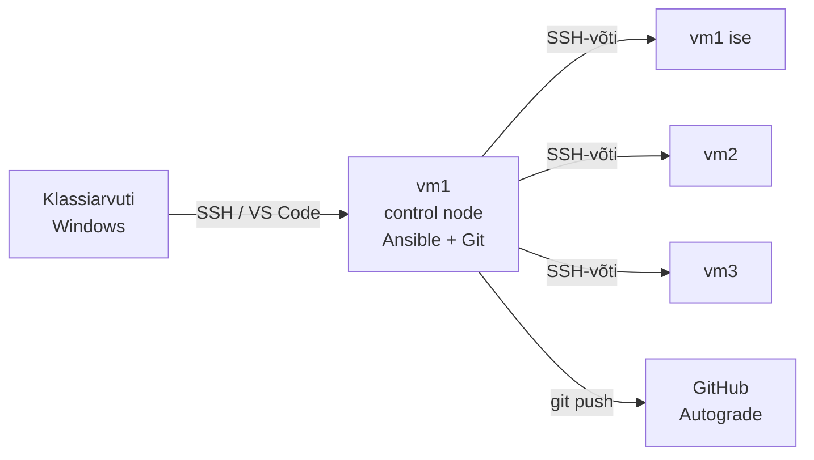

# K1 · Praktikum: esimene playbook

## Eesmärk

Tänase lõpuks on sul playbook, mis viib kolm serverit samasse olekusse: teenusekasutaja on olemas, nginx on paigaldatud ja käib, avaleht näitab serveri nime. Teine jooks ei muuda midagi (`changed=0`), ja see on tõend, et kirjeldus on idempotentne.



Praktikumil on kaks osa:

- **A · Juhendatud:** kõik ühel masinal (`localhost`), samm-sammult. Oodatava tulemuse näed iga sammu juures kokkuvolditud plokis: tee enne ise, siis võrdle.
- **B · Iseseisev:** sama oskus kolmel VM-il. Antud on eesmärk ja piirangud, lahenduse leiad ise. Vihjed on kinnistes plokkides.

Loengu vastavad peatükid on iga sammu juures viidatud. Kui mõni mõiste on udune, ava [loeng](lecture.md) samal ajal teises aknas.

## 🎯 Õpiväljundid

Praktikumi lõpuks oskad:

1. näidata oma masinas, miks toores skript pole idempotentne, ja parandada see;
2. luua inventari ja ansible.cfg-i ning kasutada ad-hoc käske ja fakte;
3. kirjutada playbooki päris moodulitega ja tõestada idempotentsust `changed=0`-ga;
4. eelvaadata muudatust `--check --diff`-ga ja parandada drift'i;
5. seadistada võtmepõhise SSH ja rakendada sama playbooki kolmele masinale;
6. valida OS-ist sõltuvad väärtused faktide järgi;
7. dokumenteerida töö README-s ja esitada see Giti kaudu.

---

## 0 · Valmisolek

### 0.1 Ühendus vm1-ga

Klassiarvuti on Windows, aga töö käib kooli Proxmoxi klastris sulle antud kolmes **AlmaLinux 9** VM-is. **vm1 on sinu control node:** sinna paigaldad Ansible'i ja Giti ning sealt haldad kõiki kolme masinat, ka vm1 ennast. Osa A teed ainult vm1-s (`localhost`), osas B lisanduvad vm2 ja vm3.

Juhendaja annab sulle kolm IP-d, kasutajanime ja parooli. Kirjuta need üles:

| Nimi | IP | Kasutaja |
|---|---|---|
| vm1 (control node) | | |
| vm2 | | |
| vm3 | | |

Ühendu Windowsist vm1-ga. Kaks võimalust:

- **VS Code:** Remote-SSH laiendus → `F1` → *Remote-SSH: Connect to Host* → `<kasutaja>@<vm1-ip>`. Terminal (`Ctrl+ö`) avaneb otse vm1-s, failid näed külgpaanil.
- **PowerShell:** `ssh <kasutaja>@<vm1-ip>`

Esimesel ühendumisel küsitakse host key kinnitust (`yes`) ja parooli.

Vaheta parool ja anna masinatele nimed. Juhendajalt saadud parool on kõigil tudengitel sama, ja masinad on ühes võrgus. Vaheta see kõigis kolmes masinas **samaks** uueks parooliks, sest Ansible küsib sudo parooli ühe korra ja kasutab seda kõigil kolmel.

Masinatel pole veel nime (prompt näitab `localhost`). Nimi aitab sul alati näha, kus oled, ja teeb Ansible'i faktid loetavaks.

```bash
passwd
sudo hostnamectl set-hostname vm1
ssh -t <kasutaja>@<vm2-ip> "passwd && sudo hostnamectl set-hostname vm2"
ssh -t <kasutaja>@<vm3-ip> "passwd && sudo hostnamectl set-hostname vm3"
exec bash
```

`passwd` küsib esmalt vana parooli, siis kaks korda uut. `sudo` küsib pärast seda juba uut parooli. Liiga lihtsa parooli lükkab AlmaLinux tagasi (`BAD PASSWORD`), vali vähemalt 8 märki tähtede ja numbritega. `ssh` küsib enne seda vm2 ja vm3 host key kinnitust (`yes`) ja vana parooli. Uus parool ei lähe kunagi üheski repo faili.

??? success "Oodatav tulemus"

    Prompt on `<kasutaja>@vm1`. Kõik järgmised käsud käivad vm1-s, mitte Windowsis.

### 0.2 Tööriistad vm1-s

```bash
sudo dnf install -y git ansible-core
ansible-galaxy collection install ansible.posix:1.5.4
git --version
ansible --version | head -3
```

??? success "Oodatav tulemus"

    ```
    git version 2.52.0
    ansible [core 2.14.18]
      config file = /etc/ansible/ansible.cfg
      configured module search path = [...]
    ```

Versioonid võivad veidi erineda. Oluline on, et `ansible` vastab. `ansible.posix` kollektsiooni (tulemüüri moodul) läheb vaja osas B. Versioon 1.5.4, sest uuemad ei toeta AlmaLinuxi `ansible-core 2.14`-t.

### 0.3 SSH-võti

Üks võtmepaar vm1-s teeb kaks asja: sellega kloonid oma privaatse repo GitHubist ja sellega ühendub Ansible osas B vm2 ja vm3 külge. Parooli pole kummalgi juhul vaja.

Loo võti. Vajuta kõigi küsimuste peale Enter:

```bash
ssh-keygen -t ed25519 -C "<eesnimi>@vm1"
cat ~/.ssh/id_ed25519.pub
```

??? success "Oodatav tulemus"

    Üks rida, mis algab `ssh-ed25519 AAAA...` ja lõpeb `<eesnimi>@vm1`. See on **avalik võti**, seda võib jagada. Fail `~/.ssh/id_ed25519` (ilma `.pub`-ita) on **privaatvõti**, see ei lahku kunagi vm1-st.

### 0.4 Võti GitHubi ja repo kloonimine

Lisa avalik võti GitHubi:

1. GitHub → paremal üleval profiilipilt → **Settings** → **SSH and GPG keys** → **New SSH key**.
2. *Title:* `vm1`, *Key type:* Authentication Key, *Key:* kleebi `cat` väljundist kogu rida.
3. **Add SSH key**.

Kontrolli vm1-s:

```bash
ssh -T git@github.com
```

??? success "Oodatav tulemus"

    Esimesel korral kinnita `yes`, siis:

    ```
    Hi <sinu-github-kasutaja>! You've successfully authenticated, but GitHub does not provide shell access.
    ```

Seadista Git ja klooni repo. Ava Classroom 50 link, mille juhendaja jagas, ja nõustu ülesandega. Sulle tekib privaatne repo organisatsioonis `hkhk-automation`. Repo lehel vajuta **Code** → vahekaart **SSH** → kopeeri aadress (algab `git@github.com:`).

```bash
git config --global user.name "Eesnimi Perenimi"
git config --global user.email "sinu@email.ee"
cd ~
git clone git@github.com:hkhk-automation/<sinu-repo>.git
cd <sinu-repo>
ls
```

??? success "Oodatav tulemus"

    ```
    README.md  ULESANNE.md  logid
    ```

Kõik tänased failid lähevad selle repo juurkausta. `git push` töötab sama võtmega, parooli ega tokenit ei küsita.

**Kontrollnimekiri:** su repo **Issues** all on selle nädala ülesanded. Samad kaardid on kursuse tahvlil (GitHubi org `hkhk-automation` → **Projects** → *ITS-25 Automatiseerimine*), vaade **Minu tööd**. Sule issue, kui osa on tehtud. Kui jääd kinni, ava uus issue mallist **Vajan abi**.

Lõpuks on repos:

```
<sinu-repo>/
├── ansible.cfg
├── inventory.ini
├── bootstrap.yml
├── halb.sh
├── README.md
└── logid/
    ├── teine_jooks.txt
    └── kolm_masinat.txt
```

---

## A · Juhendatud osa

### A1 · Käsitsi seadistus

*Loeng §1–§2*

Seadista `localhost` käsitsi veebiserveriks. Iga käsu järel kirjuta vihikusse või faili `kontrolltabel.md` rida: käsk | tulemus, mis pidi tekkima | kuidas kontrollid.

```bash
sudo useradd -m saidi
sudo dnf install -y nginx
echo "<h1>Tere käsitsi</h1>" | sudo tee /usr/share/nginx/html/index.html
sudo systemctl enable --now nginx
```

Kontrolltabeli näide:

| Käsk | Tulemus | Kontroll |
|---|---|---|
| `useradd -m saidi` | kasutaja `saidi` on olemas, kodukaust olemas | `id saidi`, `ls -d /home/saidi` |
| `dnf install nginx` | pakett paigaldatud | `rpm -q nginx` |
| `tee index.html` | avaleht sisuga | `cat /usr/share/nginx/html/index.html` |
| `systemctl enable --now` | teenus käib ja käivitub buutimisel | `systemctl is-active nginx`, `systemctl is-enabled nginx` |

??? success "Oodatav tulemus"

    ```bash
    curl -s localhost
    ```

    ```
    <h1>Tere käsitsi</h1>
    ```

Enne automatiseerimist pead teadma, mida masin peab tegema. Kontrolltabeli read muutuvad A4-s playbooki task'ideks, ja kontrolliveerg ütleb, mida moodul iga task'i juures ise kontrollib.

💭 Kui peaksid sama tegema kümnele masinale, mitmendal ununeks mõni samm? Milline samm ununeks kõige tõenäolisemalt ja miks just see?

---

### A2 · Miks mitte lihtsalt skript?

*Loeng §5*

Enne Ansible'it vaata korra, mis juhtub, kui sama töö teeb tavaline shelli skript. See on lühike demo, mitte skriptimise harjutus: Bash on sellel kursusel eeldus.

Loo repo juurkausta fail `halb.sh`:

```bash
#!/usr/bin/env bash
useradd -m raporteerija
mkdir /srv/raport
echo "seade=1" >> /srv/raport/conf
```

Jooksuta seda kaks korda ja vaata faili sisu:

```bash
sudo bash halb.sh
sudo bash halb.sh
cat /srv/raport/conf
```

??? success "Oodatav tulemus"

    ```
    useradd: user 'raporteerija' already exists
    mkdir: cannot create directory '/srv/raport': File exists
    seade=1
    seade=1
    ```

Skript andis kahest veast teada, aga duplikaatrida tekkis vaikselt. Skripti ohutuks tegemiseks peaks iga rea ette kirjutama kontrolli (`id … ||`, `mkdir -p`, `grep -qx … ||`), ja iga uus erijuht tähendab uut `if`-i. Ansible'i moodulid teevad need kontrollid ise. A4-s kirjutad sama asja playbookina ja näed vahet.

💭 Kui see skript jookseks igal ööl cronist, mitu rida `seade=1` oleks failis kuu aja pärast? Kas keegi märkaks?

Korista jäljed, et need ei segaks edasist tööd:

```bash
sudo userdel -r raporteerija
sudo rm -rf /srv/raport
```

---

### A3 · Inventar, `ansible.cfg` ja ad-hoc käsud

*Loeng §7–§9*

Loo `inventory.ini`:

```ini
[kohalik]
localhost ansible_connection=local
```

Loo `ansible.cfg`, et ei peaks iga käsu juurde `-i inventory.ini` kirjutama:

```ini
[defaults]
inventory = inventory.ini
callback_result_format = yaml

[privilege_escalation]
become_ask_pass = True

[ssh_connection]
pipelining = True
```

`become_ask_pass` tähendab, et iga kord, kui Ansible vajab sudo-õigust (`-b` või `become: true`), küsib ta alguses `BECOME password:`. Sisesta oma kasutaja parool.

Kontrolli, et Ansible kasutab just seda faili:

```bash
ansible --version | grep "config file"
ansible-inventory --graph
```

??? success "Oodatav tulemus"

    ```
      config file = /home/<sina>/<sinu-repo>/ansible.cfg
    @all:
      |--@ungrouped:
      |--@kohalik:
      |  |--localhost
    ```

Esimesed ad-hoc käsud:

```bash
ansible kohalik -m ping
ansible kohalik -m setup -a "filter=ansible_distribution*"
ansible kohalik -m setup -a "filter=ansible_os_family"
ansible kohalik -m command -a "uptime"
```

??? success "Oodatav tulemus"

    ```
    localhost | SUCCESS =>
        changed: false
        ping: pong
    localhost | SUCCESS =>
        ansible_facts:
            ansible_distribution: AlmaLinux
            ...
            ansible_distribution_version: '9.8'
    localhost | SUCCESS =>
        ansible_facts:
            ansible_os_family: RedHat
    localhost | CHANGED | rc=0 >>
     10:42:17 up  1:03,  1 user,  load average: 0.08, 0.05, 0.01
    ```

Pane tähele viimast rida: `uptime` ei muuda midagi, aga Ansible märgib selle `CHANGED`-ks, sest `command` ei tea, mida käsk tegi.

Ad-hoc käsk, mis muudab midagi:

```bash
ansible kohalik -b -m package -a "name=tree state=present"
ansible kohalik -b -m package -a "name=tree state=present"
```

??? success "Oodatav tulemus"

    Esimene kord `CHANGED`, teine kord `SUCCESS` ja `"changed": false`.

Moodul (`ping`, `setup`, `package`) tagastab struktureeritud info ja teab, kas ta midagi muutis. `command` tagastab ainult teksti ja on alati `CHANGED`. `ansible_os_family` läheb vaja osas B.

💭 Kui tahad playbookis öelda "kui masin on RedHati perest, tee X", kumb annab selleks info: `setup` või `command`? Miks?

---

### A4 · Esimene playbook

*Loeng §4, §11, §14*

Nüüd paned A1 käsitsitöö kirja soovitud olekuna. Ehita playbook **üks task korraga** ja jooksuta iga lisanduse järel. Nii tead alati, milline task vea tekitas.

**Samm 1.** Loo `bootstrap.yml` ühe task'iga:

```yaml
- name: Bootstrap veebiserver
  hosts: kohalik
  become: true
  tasks:
    - name: Kasutaja saidi on olemas
      ansible.builtin.user:
        name: saidi
```

Kontrolli süntaksit ja vaata, mida playbook teeks:

```bash
ansible-playbook bootstrap.yml --syntax-check
ansible-playbook bootstrap.yml --list-tasks
```

??? success "Oodatav tulemus"

    ```
    playbook: bootstrap.yml

      play #1 (kohalik): Bootstrap veebiserver	TAGS: []
        tasks:
          Kasutaja saidi on olemas	TAGS: []
    ```

Jooksuta:

```bash
ansible-playbook bootstrap.yml
```

```
TASK [Kasutaja saidi on olemas] *******************************
ok: [localhost]

PLAY RECAP ****************************************************
localhost : ok=2  changed=0  unreachable=0  failed=0  skipped=0
```

`ok`, sest kasutaja on A1-st juba olemas. `ok=2` sisaldab ka faktide kogumist.

**Sammud 2–4.** Lisa ükshaaval ja jooksuta iga lisanduse järel. Parameetrid leiad `ansible-doc`-ist:

```bash
ansible-doc -s ansible.builtin.package
ansible-doc -s ansible.builtin.copy
ansible-doc -s ansible.builtin.service
```

1. `ansible.builtin.package`: pakett `nginx`, `state: present`
2. `ansible.builtin.copy`: fail `/usr/share/nginx/html/index.html`, `content: "<h1>Hallatud Ansible'iga</h1>\n"`
3. `ansible.builtin.service`: `nginx`, `state: started`, `enabled: true`

Iga task'i `name` kirjuta soovitud olekuna: "nginx on paigaldatud", mitte "paigalda nginx".

**Enne viimast jooksu ennusta.** Täida tabel vihikus:

| Task | Ennustus: ok või changed? | Miks | Tegelik |
|---|---|---|---|
| Kasutaja saidi on olemas | | | |
| nginx on paigaldatud | | | |
| Avaleht on paigas | | | |
| nginx käib | | | |

```bash
ansible-playbook bootstrap.yml
curl -s localhost
```

??? success "Oodatav tulemus"

    ```
    TASK [Avaleht on paigas] **************************************
    changed: [localhost]

    PLAY RECAP ****************************************************
    localhost : ok=5  changed=1  unreachable=0  failed=0  skipped=0

    <h1>Hallatud Ansible'iga</h1>
    ```

Ainult avalehe sisu erines käsitsi tehtust. Kõik muu oli juba soovitud olekus, ja moodulid tuvastasid selle ise.

💡 `Permission denied` või `You need to be root`: `become: true` puudub. `Missing sudo password`: `ansible.cfg`-s puudub `become_ask_pass = True`. `Waiting for process ... dnf`: taustal käib teine dnf, oota. `this task has extra params`: parameeter on vale taandega (loeng §10).

---

### A5 · Teine jooks ja `command`-katse

*Loeng §5*

Jooksuta playbook kohe uuesti ja salvesta väljund:

```bash
ansible-playbook bootstrap.yml | tee logid/teine_jooks.txt
```

??? success "Oodatav tulemus"

    ```
    PLAY RECAP ****************************************************
    localhost : ok=5  changed=0  unreachable=0  failed=0  skipped=0
    ```

See on idempotentsuse tõend: masin on juba soovitud olekus ja kirjeldus ei tee midagi. Automaatne kontroll vaatab seda faili.

Lisa playbooki lõppu ajutine task:

```yaml
    - name: Ajutine katse
      ansible.builtin.command: date
```

Jooksuta kaks korda.

??? success "Oodatav tulemus"

    Mõlemal korral `changed=1`. `command` on igal jooksul `changed`, kuigi `date` ei muuda midagi.

Muuda task'i, et see oleks idempotentne `creates` abil:

```yaml
    - name: Märgi, et bootstrap on tehtud
      ansible.builtin.command: touch /var/lib/bootstrap-tehtud
      args:
        creates: /var/lib/bootstrap-tehtud
```

Jooksuta kaks korda. Esimene `changed`, teine `ok`.

Seejärel eemalda katse-task ja jooksuta veel kord, kuni `PLAY RECAP` on `changed=0`. Salvesta see uuesti `logid/teine_jooks.txt`-sse.

Toores käsk ei tea olekut. Kui moodulit pole, teeb `creates` käsu idempotentseks: käsku ei käivitata, kui fail on juba olemas. Päris töös kasuta moodulit, kui see on olemas (`ansible.builtin.file` + `state: touch` teeks sama).

---

### A6 · Dry run

*Loeng §16*

Muuda `bootstrap.yml`-is avalehe teksti, näiteks `<h1>Versioon 2</h1>\n`. Jooksuta kuivalt:

```bash
ansible-playbook bootstrap.yml --check --diff
curl -s localhost
```

??? success "Oodatav tulemus"

    ```
    TASK [Avaleht on paigas] **************************************
    --- before: /usr/share/nginx/html/index.html
    +++ after: /usr/share/nginx/html/index.html
    @@ -1 +1 @@
    -<h1>Hallatud Ansible'iga</h1>
    +<h1>Versioon 2</h1>
    changed: [localhost]

    PLAY RECAP ****************************************************
    localhost : ok=5  changed=1  unreachable=0  failed=0  skipped=0

    <h1>Hallatud Ansible'iga</h1>
    ```

`changed=1`, aga `curl` näitab vana lehte. Midagi ei muudetud.

Jooksuta päriselt ja kontrolli:

```bash
ansible-playbook bootstrap.yml
curl -s localhost
```

Tootmises vaatad enne muutust, mida see teeks. `--diff` näitab täpselt, mis rida muutub, ja see on see, mida kolleeg code review's näha tahab.

💭 Lisa ajutiselt tagasi `command: date` task ja jooksuta `--check`. Mida näitab väljund selle task'i kohta? Miks? **Eemalda task pärast uuesti**, automaatne kontroll K3 ei luba `command`-i.

---

### A7 · Drift

*Loeng §16*

Tekita kolm kõrvalekallet, nagu teeks kolleeg öösel käsitsi:

```bash
sudo rm /usr/share/nginx/html/index.html
sudo systemctl stop nginx
sudo userdel saidi
```

**Enne jooksu ennusta:**

| Task | Ennustus | Tegelik |
|---|---|---|
| Kasutaja saidi on olemas | | |
| nginx on paigaldatud | | |
| Avaleht on paigas | | |
| nginx käib | | |

```bash
ansible-playbook bootstrap.yml --check
ansible-playbook bootstrap.yml
curl -s localhost
```

??? success "Oodatav tulemus"

    `--check` näitab 3 `changed`-i ilma midagi parandamata. Päris jooks näitab samuti 3 `changed`-i, `nginx on paigaldatud` jääb `ok`. `curl` vastab uuesti.

Playbook parandas ainult selle, mis triivis, ja sa ei pidanud talle ütlema, mis katki on. `--check` üksi on drift'i avastamise tööriist: nii saab öösel kontrollida kõiki masinaid ilma midagi muutmata.

💭 Mis oleks juhtunud, kui keegi oleks A7-s nginx-i paketi eemaldanud (`dnf remove nginx`)? Mitu `changed`-i? Kas avaleht oleks alles?

---

### A8 · Muutujad ja `debug`

*Loeng §13*

Lisa play'le `vars` plokk ja kasuta muutujat avalehel:

```yaml
- name: Bootstrap veebiserver
  hosts: kohalik
  become: true
  vars:
    lehe_pealkiri: "Hallatud Ansible'iga"
  tasks:
    - name: Näita fakte, mida lehel kasutame
      ansible.builtin.debug:
        msg: "{{ inventory_hostname }} / {{ ansible_distribution }} {{ ansible_distribution_version }}"

    # ... olemasolevad task'id ...

    - name: Avaleht on paigas
      ansible.builtin.copy:
        dest: /usr/share/nginx/html/index.html
        content: "<h1>{{ lehe_pealkiri }}</h1><p>{{ inventory_hostname }}, {{ ansible_distribution }}</p>\n"
```

```bash
ansible-playbook bootstrap.yml
curl -s localhost
```

??? success "Oodatav tulemus"

    ```
    TASK [Näita fakte, mida lehel kasutame] ***********************
    ok: [localhost] =>
        msg: localhost / AlmaLinux 9.8

    <h1>Hallatud Ansible'iga</h1><p>localhost, AlmaLinux</p>
    ```

Kirjuta muutuja üle käsurealt, ilma faili muutmata:

```bash
ansible-playbook bootstrap.yml -e "lehe_pealkiri=Test"
curl -s localhost
```

Seejärel jooksuta ilma `-e`-ta, et leht saaks tagasi soovitud oleku.

Muutuja teeb playbooki taaskasutatavaks. `-e` (extra vars) on kõige kõrgema prioriteediga ja kirjutab üle kõik muu. Teisel kohtumisel paneme muutujad gruppide kaupa failidesse.

---

## B · Iseseisev osa: kolm serverit

### Eesmärk

Vii kõik kolm VM-i (vm1, vm2, vm3) samasse olekusse **sama** `bootstrap.yml`-iga, mille kirjutasid osas A. Iga server näitab avalehel oma inventari nime. Masinate andmed on sul osa 0.1 tabelis.

vm1 on nii control node kui üks kolmest serverist. Ansible ühendub ka vm1-ga üle SSH, seega kopeeri osas 0.3 tehtud avalik võti **kõigile kolmele**, ka vm1 enda IP-le.

Kõik kolm on AlmaLinux 9. Playbook peab siiski valima OS-ist sõltuvad väärtused fakti järgi, nii et see töötaks muutmata ka Ubuntu masinal.

### Piirangud

- Ansible ühendub SSH-võtmega. Parool ei tohi olla üheski repo failis.
- Üks playbook kõigile kolmele. OS-ist sõltuvad väärtused (veebi juurkaust) valitakse **fakti järgi**, mitte käsitsi hosti kaupa.
- Tulemüüris peab `http` olema avatud, ka see käib playbookiga (`ansible.posix.firewalld`), mitte käsitsi.
- `localhost` jääb inventari alles, aga B-osa playbook sihib ainult gruppi `veeb`.
- Enne kõiki masinaid proovi ühel (`--limit`).
- `command`/`shell` pole lubatud seal, kus on olemas moodul.

### Valmis, kui

- [ ] `ssh vm1 hostname`, `ssh vm2 hostname`, `ssh vm3 hostname` vastavad ilma parooli küsimata.
- [ ] `ansible veeb -m ping` annab kolm `pong`-i.
- [ ] vm1-st `curl http://<vm-ip>` näitab iga masina puhul selle nime (vm2 ja vm3 vastavad alles pärast tulemüüri avamist).
- [ ] Teine jooks kõigil kolmel: `changed=0`, `unreachable=0`, salvestatud faili `logid/kolm_masinat.txt`.
- [ ] Drift ühes masinas (nt peatatud nginx) parandub ühe jooksuga, ja teised kaks jäävad `changed=0`.

### Soovitatav järjekord

1. `ssh-copy-id` kõigile kolmele ja `~/.ssh/config`.
2. Käsitsi `ssh vm2 hostname`, `ssh vm3 hostname`: vastab `vm2`, `vm3` (nimed panid 0.1-s).
3. Inventari grupp `veeb`.
4. `ping` ja faktid.
5. Playbook: `hosts`, juurkaust fakti järgi, leht masina nimega, tulemüür.
6. `--check --diff --limit vm1` → `--limit vm1` → kõik → teine jooks.

    Värskes masinas (vm2, vm3) kukub `--check` task'is "nginx käib": kuivjooks ei paigalda nginx'i päriselt, seega teenust pole veel. See on ootuspärane.
7. Drift ühes masinas.

### Vihjed

Ava ainult siis, kui oled ise proovinud ja jäänud kinni.

??? tip "1 · Võti vm-idesse"
    Võti on sul osast 0.3 olemas. Kopeeri avalik võti iga masina kohta, ka vm1 enda IP-le:

    ```bash
    ssh-copy-id -i ~/.ssh/id_ed25519.pub <kasutaja>@<vm1-ip>
    ssh-copy-id -i ~/.ssh/id_ed25519.pub <kasutaja>@<vm2-ip>
    ssh-copy-id -i ~/.ssh/id_ed25519.pub <kasutaja>@<vm3-ip>
    ```

    Iga kord küsitakse üks kord parooli, siis enam mitte. Privaatvõti (`id_ed25519`, ilma `.pub`-ita) ei lahku vm1-st.

??? tip "2 · `~/.ssh/config`"
    ```
    Host vm1
        HostName <ip>
        User <kasutaja>
        IdentityFile ~/.ssh/id_ed25519
    ```

    Kolm plokki, üks iga masina kohta. Pärast seda töötab `ssh vm1`, ja Ansible kasutab sama nime.

    Faili õigused peavad olema `600`: `chmod 600 ~/.ssh/config`.

??? tip "3 · Host key kinnitus"
    Esimesel ühendumisel küsib SSH `Are you sure you want to continue connecting (yes/no)?`. Ansible peatub samas kohas. Ühendu esimest korda käsitsi (`ssh vm1 hostname`) või kogu võtmed korraga: `ssh-keyscan <ip1> <ip2> <ip3> >> ~/.ssh/known_hosts`.

??? tip "4 · Inventar"
    Lisa `inventory.ini`-sse:

    ```ini
    [veeb]
    vm1
    vm2
    vm3
    ```

    `ansible-inventory --graph` peab näitama mõlemat gruppi.

??? tip "5 · Playbook kolmele"
    Muuda `hosts: kohalik` → `hosts: veeb`. Kui tahad, et sama fail töötaks ka `localhost`-il, kasuta `hosts: kohalik:veeb` ja jooksuta `--limit veeb`.

??? tip "6 · Veebi juurkaust erineb"
    RedHati peres (AlmaLinux, Rocky, Fedora) serveerib nginx faile kaustast `/usr/share/nginx/html`, Debiani peres (Ubuntu, Debian) kaustast `/var/www/html`. Sinu masinad on kõik RedHati perest, aga playbook peab töötama mõlemal.

    Kontrolli: `ansible veeb -m setup -a "filter=ansible_os_family"`.

    Playbookis muutuja, mille väärtus sõltub faktist (loeng §13):

    ```yaml
    vars:
      veebi_juur: "{{ '/var/www/html' if ansible_os_family == 'Debian' else '/usr/share/nginx/html' }}"
    ```

    ja `copy`-task'is `dest: "{{ veebi_juur }}/index.html"`.

??? tip "7 · Masina nimi lehel"
    `content: "<h1>{{ inventory_hostname }}</h1>\n"`. `inventory_hostname` on nimi inventaris (`vm1`), mitte masina enda hostname.

??? tip "8 · Sudo parool kolmes masinas"
    `ansible.cfg`-s on `become_ask_pass = True` (A3), nii et Ansible küsib `BECOME password:` ühe korra ja kasutab seda kõigis masinates. Kui paroolid on masinates erinevad, küsi juhendajalt.

??? tip "9 · Tulemüür"
    AlmaLinuxis on `firewalld` sees ja lubab vaikimisi ainult `ssh`-i. Seepärast vastab vm1 iseendale (`curl localhost`), aga vm2 ja vm3 ei vasta väljast. Kontrolli: `ansible veeb -b -m command -a "firewall-cmd --list-services"`.

    Lisa playbooki task mooduliga `ansible.posix.firewalld`: `service: http`, `permanent: true`, `immediate: true`, `state: enabled`. Et see töötaks ka Ubuntul (seal firewalld-d pole), lisa `when: ansible_os_family == 'RedHat'`.

??? tip "10 · Kas leht tuli õigest masinast?"
    `for h in <ip1> <ip2> <ip3>; do curl -s http://$h; done`

### Kontroll

```bash
ansible veeb -m ping
ansible-playbook bootstrap.yml --limit veeb --check --diff
ansible-playbook bootstrap.yml --limit vm1
ansible-playbook bootstrap.yml --limit veeb
ansible-playbook bootstrap.yml --limit veeb | tee logid/kolm_masinat.txt
```

Viimase käsu `PLAY RECAP` peab välja nägema umbes nii:

```
PLAY RECAP ****************************************************
vm1 : ok=6  changed=0  unreachable=0  failed=0  skipped=0
vm2 : ok=6  changed=0  unreachable=0  failed=0  skipped=0
vm3 : ok=6  changed=0  unreachable=0  failed=0  skipped=0
```

Drift ühes masinas:

```bash
ssh -t vm2 "sudo systemctl stop nginx"
ansible-playbook bootstrap.yml --limit veeb
```

Ootus: `vm2` näitab `changed=1`, `vm1` ja `vm3` näitavad `changed=0`.

---

## Dokumenteerimine

### README

Repos on juba `README.md` mall. Täida see: asenda kõik nurksulgudes kohad oma tööga ja kustuta ülemine kast. README on dokument, mille järgi keegi teine (või sina kolme kuu pärast) saab masinad sama olekusse viia. Ülesande kirjeldus on eraldi failis `ULESANNE.md`, seda ära muuda.

Iga peegeldusküsimuse vastus 2–4 lauset. Automaatne kontroll K1 kukub, kui README-s on veel täitmata kohti või kui see on alla 150 sõna.

### Commit ja push

```bash
git status
git add .
git commit -m "K1: bootstrap playbook, idempotentne, 3 masinat"
git push
```

`git status` enne `add`-i näitab, mis faile lisad. Kontrolli, et seal pole midagi, mis ei kuulu reposse: võtmed, paroolid, `.retry` failid.

💡 Kui `git push` küsib kasutajanime või parooli, kloonisid repo HTTPS-iga. Vaheta SSH peale: `git remote set-url origin git@github.com:hkhk-automation/<sinu-repo>.git` (võti peab olema GitHubis, osa 0.4).

### Automaatne kontroll

Ava GitHubis oma repo → **Actions** → viimane **Autograde**. Seal on iga kontrolli tulemus ja punktisumma. Klassitöö kontrollid K1–K5 peavad olema läbitud:

| Kontroll | Mida vaatab |
|---|---|
| K1 | failid `halb.sh`, `inventory.ini`, `bootstrap.yml`, `logid/teine_jooks.txt` olemas; `README.md` mall täidetud (≥150 sõna) |
| K2 | `bootstrap.yml` süntaks |
| K3 | päris moodulid, `command`/`shell` puudub |
| K4 | `logid/teine_jooks.txt` sisaldab `changed=0` |
| K5 | `logid/kolm_masinat.txt`: kolm masinat, kõigil `changed=0`, ükski pole `unreachable` |

Kui kontroll on punane, ava job ja leia rida, kus on `FAIL` või `PUUDU`. Paranda, commit'i, push'i uuesti.

Kodutöö kontrollid (H1–H6 jne) kukuvad seni, kuni kodutöö pole tehtud, ja seetõttu on kogu Autograde punane. See on ootuspärane: loeb punktisumma, mitte värv.

---

## Kodutöö

Kodune õpe ja kodutöö on eraldi lehel: **[K1 · Kodune õpe ja kodutöö](homework.md)**. Samasse reposse, tähtaeg Classroom 50-s.

---

## Veaotsing

Kontrolli järjekorras: loe veateade algusest lõpuni, korda käsku `-v`-ga, proovi sama asja käsitsi sihtmasinas.

| Probleem | Põhjus | Lahendus |
|---|---|---|
| `ansible: command not found` | Ansible pole paigaldatud | `sudo dnf install -y ansible-core` |
| `config file = None` | `ansible.cfg` pole jooksvas kaustas | `cd ~/<sinu-repo>` |
| `Could not match supplied host pattern` | grupp puudub inventaris | `ansible-inventory --graph` |
| `ping` localhostile ei vasta | `ansible_connection=local` puudu | vaata `inventory.ini` |
| VM: `UNREACHABLE` | SSH ei tööta | `ssh vm1 hostname` käsitsi, siis `-vvv` |
| `Permission denied (publickey)` | avalik võti pole sihtmasinas | korda `ssh-copy-id` |
| `Host key verification failed` | host key muutus (VM uuesti loodud) | `ssh-keygen -R vm1` |
| `Permission denied` task'is | `become: true` puudu | lisa play tasemele |
| `Invalid callback for stdout specified: yaml` | `ansible.cfg`-s vana rida `stdout_callback = yaml` | asenda `callback_result_format = yaml` |
| `Missing sudo password` | `ansible.cfg`-s pole `become_ask_pass = True` | lisa `[privilege_escalation]` plokk (A3) |
| `couldn't resolve module/action 'ansible.posix.firewalld'` | kollektsioon puudu | `ansible-galaxy collection install ansible.posix:1.5.4` |
| `Could not find the requested service nginx` `--check`-iga | värskes masinas pole nginx'i veel päriselt paigaldatud | ootuspärane, jooksuta ilma `--check`-ita |
| `sudo: a terminal is required` | `ssh vm2 "sudo ..."` ilma terminalita | `ssh -t vm2 "sudo ..."` |
| `Waiting for process ... dnf` | taustal käib teine dnf | oota |
| `mapping values are not allowed` | YAML: koolon väärtuses | jutumärgid |
| `this task has extra params` | parameeter vale taandega | vaata taanet, loeng §10 |
| `couldn't resolve module/action` | mooduli nimi vale | `ansible-doc -l \| grep <nimi>` |
| task on igal jooksul `changed` | `command`/`shell` mooduli asemel | vaheta moodul |
| `curl` näitab nginx vaikelehte | fail läks vale kausta | `debug: var=veebi_juur` |
| `curl` väljast ei vasta, masinas vastab | tulemüür (RedHat) | vihje 9 |
| käsk töötab PowerShellis, aga mitte vm1-s (või vastupidi) | oled vales aknas | `hostname` — kõik käsud käivad vm1-s |
| `git push` küsib parooli | repo on kloonitud HTTPS-iga | `git remote set-url origin git@github.com:...` |
| `Permission denied (publickey)` GitHubist | võti pole GitHubis | osa 0.4 |

---

## Allikad

| Allikas | URL |
|---|---|
| Ansible: getting started | <https://docs.ansible.com/ansible/latest/getting_started/> |
| Ad-hoc käsud | <https://docs.ansible.com/ansible/latest/command_guide/intro_adhoc.html> |
| Ansible builtin moodulid | <https://docs.ansible.com/ansible/latest/collections/ansible/builtin/> |
| Faktid ja muutujad | <https://docs.ansible.com/ansible/latest/playbook_guide/playbooks_vars_facts.html> |
| Check mode ja diff | <https://docs.ansible.com/ansible/latest/playbook_guide/playbooks_checkmode.html> |
| VS Code Remote-SSH | <https://code.visualstudio.com/docs/remote/ssh> |
| GitHub: SSH-võti kontole | <https://docs.github.com/en/authentication/connecting-to-github-with-ssh/adding-a-new-ssh-key-to-your-github-account> |
