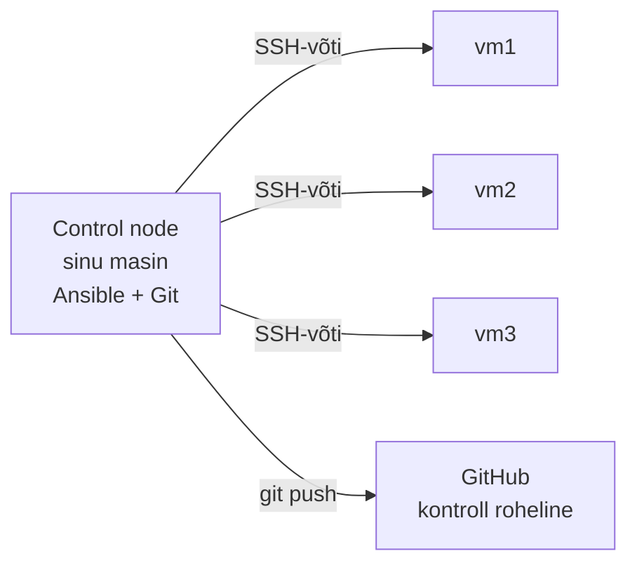

# K1 · Praktikum: esimene playbook

## Eesmärk

Tänase lõpuks on sul playbook, mis viib kolm serverit samasse olekusse: teenusekasutaja on olemas, nginx on paigaldatud ja käib, avaleht näitab serveri nime. Teine jooks ei muuda midagi (`changed=0`), ja see on tõend, et kirjeldus on idempotentne.



Praktikumil on kaks osa:

- **A · Juhendatud:** kõik ühel masinal (`localhost`), samm-sammult. Iga samm on kujul **Tegevus → Oodatav tulemus → Miks → Tõend**.
- **B · Iseseisev:** sama oskus kolmel VM-il. Antud on eesmärk ja piirangud, lahenduse leiad ise. Vihjed on kinnistes plokkides.

Loengu vastavad peatükid on iga sammu juures viidatud. Kui mõni mõiste on udune, ava [loeng](lecture.md) samal ajal teises aknas.

## 🎯 Õpiväljundid

Praktikumi lõpuks oskad:

1. näidata oma masinas, miks toores skript pole idempotentne, ja parandada see;
2. luua inventari ja ansible.cfg-i ning kasutada ad-hoc käske ja fakte;
3. kirjutada playbooki päris moodulitega ja tõestada idempotentsust `changed=0`-ga;
4. eelvaadata muudatust `--check --diff`-ga ja parandada drift'i;
5. seadistada võtmepõhise SSH ja rakendada sama playbooki kolmele masinale;
6. valida OS-ist sõltuvad väärtused faktide järgi;
7. dokumenteerida töö README-s ja esitada see Giti kaudu.

---

## 0 · Valmisolek

### 0.1 Tööriistad

**Tegevus:**

```bash
git --version
ansible --version | head -3
python3 --version
systemctl is-system-running
```

**Oodatav tulemus:**

```
git version 2.43.0
ansible [core 2.16.3]
  config file = None
  configured module search path = [...]
Python 3.12.3
running
```

Versioonid võivad erineda. Oluline on, et `ansible` vastab ja `ansible-core` on vähemalt 2.15. `systemctl` võib vastata ka `degraded`, see on korras.

**Kui midagi puudub:**

| Puudu | Lahendus |
|---|---|
| `git` | `sudo apt install -y git` |
| `ansible` | `sudo apt update && sudo apt install -y ansible` |
| `systemctl`: `System has not been booted with systemd` (WSL) | vt allpool |

WSL-is peab systemd olema sisse lülitatud. Kontrolli faili `/etc/wsl.conf`:

```bash
cat /etc/wsl.conf
```

Kui seal pole ridu `[boot]` ja `systemd=true`, lisa need:

```bash
printf "[boot]\nsystemd=true\n" | sudo tee -a /etc/wsl.conf
```

Seejärel PowerShellis `wsl --shutdown` ja ava WSL uuesti.

### 0.2 Git

Kui sa pole selles masinas Giti kasutanud, seadista nimi ja e-post. Need lähevad iga commit'i juurde:

```bash
git config --global user.name "Eesnimi Perenimi"
git config --global user.email "sinu@email.ee"
```

### 0.3 Repo

Ava Classroom 50 link, mille juhendaja jagas, ja nõustu ülesandega. Sulle tekib oma repo organisatsioonis `hkhk-automation`. Klooni see oma kodukausta, mitte Windowsi kettale:

```bash
cd ~
git clone https://github.com/hkhk-automation/<sinu-repo>.git
cd <sinu-repo>
ls -la
```

**Oodatav tulemus:**

```
.github/
.gitignore
README.md
ULESANNE.md
logid/
```

Kõik tänased failid lähevad selle repo juurkausta. Lõpuks on struktuur selline:

```
<sinu-repo>/
├── ansible.cfg
├── inventory.ini
├── bootstrap.yml
├── halb.sh
├── README.md
└── logid/
    ├── teine_jooks.txt
    └── kolm_masinat.txt
```

**Miks kodukaust:** WSL-is on Windowsi ketas (`/mnt/c/...`) kõigile kirjutatav, ja Ansible ignoreerib seal `ansible.cfg`-d turvakaalutlustel (loeng §7).

---

## A · Juhendatud osa

### A1 · Käsitsi seadistus

*Loeng §1–§2*

**Tegevus:** seadista `localhost` käsitsi veebiserveriks. Iga käsu järel kirjuta vihikusse või faili `kontrolltabel.md` rida: käsk | tulemus, mis pidi tekkima | kuidas kontrollid.

```bash
sudo useradd -m saidi
sudo apt install -y nginx
echo "<h1>Tere käsitsi</h1>" | sudo tee /var/www/html/index.html
sudo systemctl enable --now nginx
```

Kontrolltabeli näide:

| Käsk | Tulemus | Kontroll |
|---|---|---|
| `useradd -m saidi` | kasutaja `saidi` on olemas, kodukaust olemas | `id saidi`, `ls -d /home/saidi` |
| `apt install nginx` | pakett paigaldatud | `dpkg -s nginx \| grep Status` |
| `tee index.html` | avaleht sisuga | `cat /var/www/html/index.html` |
| `systemctl enable --now` | teenus käib ja käivitub buutimisel | `systemctl is-active nginx`, `systemctl is-enabled nginx` |

**Oodatav tulemus:**

```bash
curl -s localhost
```

```
<h1>Tere käsitsi</h1>
```

**Miks:** enne automatiseerimist pead teadma, mida masin peab tegema. Kontrolltabeli read muutuvad A4-s playbooki task'ideks, ja kontrolliveerg ütleb, mida moodul iga task'i juures ise kontrollib.

**Tõend:** kontrolltabel, 4 rida.

💭 Kui peaksid sama tegema kümnele masinale, mitmendal ununeks mõni samm? Milline samm ununeks kõige tõenäolisemalt ja miks just see?

---

### A2 · Miks mitte lihtsalt skript?

*Loeng §5*

Enne Ansible'it vaata korra, mis juhtub, kui sama töö teeb tavaline shelli skript. See on lühike demo, mitte skriptimise harjutus: Bash on sellel kursusel eeldus.

**Tegevus:** loo repo juurkausta fail `halb.sh`:

```bash
#!/usr/bin/env bash
useradd -m raporteerija
mkdir /srv/raport
echo "seade=1" >> /srv/raport/conf
```

Jooksuta seda kaks korda ja vaata faili sisu:

```bash
sudo bash halb.sh
sudo bash halb.sh
cat /srv/raport/conf
```

**Oodatav tulemus:**

```
useradd: user 'raporteerija' already exists
mkdir: cannot create directory '/srv/raport': File exists
seade=1
seade=1
```

**Miks:** skript andis kahest veast teada, aga duplikaatrida tekkis vaikselt. Skripti ohutuks tegemiseks peaks iga rea ette kirjutama kontrolli (`id … ||`, `mkdir -p`, `grep -qx … ||`), ja iga uus erijuht tähendab uut `if`-i. Ansible'i moodulid teevad need kontrollid ise. A4-s kirjutad sama asja playbookina ja näed vahet.

**Tõend:** `halb.sh` repos.

💭 Kui see skript jookseks igal ööl cronist, mitu rida `seade=1` oleks failis kuu aja pärast? Kas keegi märkaks?

Korista jäljed, et need ei segaks edasist tööd:

```bash
sudo userdel -r raporteerija
sudo rm -rf /srv/raport
```

---

### A3 · Inventar, `ansible.cfg` ja ad-hoc käsud

*Loeng §7–§9*

**Tegevus:** loo `inventory.ini`:

```ini
[kohalik]
localhost ansible_connection=local
```

Loo `ansible.cfg`, et ei peaks iga käsu juurde `-i inventory.ini` kirjutama:

```ini
[defaults]
inventory = inventory.ini
stdout_callback = yaml

[ssh_connection]
pipelining = True
```

Kontrolli, et Ansible kasutab just seda faili:

```bash
ansible --version | grep "config file"
ansible-inventory --graph
```

**Oodatav tulemus:**

```
  config file = /home/<sina>/<sinu-repo>/ansible.cfg
@all:
  |--@ungrouped:
  |--@kohalik:
  |  |--localhost
```

**Tegevus:** esimesed ad-hoc käsud:

```bash
ansible kohalik -m ping
ansible kohalik -m setup -a "filter=ansible_distribution*"
ansible kohalik -m setup -a "filter=ansible_os_family"
ansible kohalik -m command -a "uptime"
```

**Oodatav tulemus:**

```
localhost | SUCCESS => {
    "changed": false,
    "ping": "pong"
}
localhost | SUCCESS => {
    "ansible_facts": {
        "ansible_distribution": "Ubuntu",
        "ansible_distribution_version": "24.04",
        ...
localhost | SUCCESS => {
    "ansible_facts": {
        "ansible_os_family": "Debian"
...
localhost | CHANGED | rc=0 >>
 10:42:17 up  1:03,  1 user,  load average: 0.08, 0.05, 0.01
```

Pane tähele viimast rida: `uptime` ei muuda midagi, aga Ansible märgib selle `CHANGED`-ks, sest `command` ei tea, mida käsk tegi.

**Tegevus:** ad-hoc käsk, mis muudab midagi:

```bash
ansible kohalik -b -m package -a "name=tree state=present"
ansible kohalik -b -m package -a "name=tree state=present"
```

**Oodatav tulemus:** esimene kord `CHANGED`, teine kord `SUCCESS` ja `"changed": false`.

**Miks:** moodul (`ping`, `setup`, `package`) tagastab struktureeritud info ja teab, kas ta midagi muutis. `command` tagastab ainult teksti ja on alati `CHANGED`. `ansible_os_family` läheb vaja osas B.

**Tõend:** `inventory.ini` ja `ansible.cfg` repos.

💭 Kui tahad playbookis öelda "kui masin on Debiani perest, tee X", kumb annab selleks info: `setup` või `command`? Miks?

---

### A4 · Esimene playbook

*Loeng §4, §11, §14*

Nüüd paned A1 käsitsitöö kirja soovitud olekuna. Ehita playbook **üks task korraga** ja jooksuta iga lisanduse järel. Nii tead alati, milline task vea tekitas.

**Tegevus, samm 1:** loo `bootstrap.yml` ühe task'iga:

```yaml
- name: Bootstrap veebiserver
  hosts: kohalik
  become: true
  tasks:
    - name: Kasutaja saidi on olemas
      ansible.builtin.user:
        name: saidi
```

Kontrolli süntaksit ja vaata, mida playbook teeks:

```bash
ansible-playbook bootstrap.yml --syntax-check
ansible-playbook bootstrap.yml --list-tasks
```

**Oodatav tulemus:**

```
playbook: bootstrap.yml

  play #1 (kohalik): Bootstrap veebiserver	TAGS: []
    tasks:
      Kasutaja saidi on olemas	TAGS: []
```

Jooksuta:

```bash
ansible-playbook bootstrap.yml
```

```
TASK [Kasutaja saidi on olemas] *******************************
ok: [localhost]

PLAY RECAP ****************************************************
localhost : ok=2  changed=0  unreachable=0  failed=0  skipped=0
```

`ok`, sest kasutaja on A1-st juba olemas. `ok=2` sisaldab ka faktide kogumist.

**Tegevus, samm 2–4:** lisa ükshaaval ja jooksuta iga lisanduse järel. Parameetrid leiad `ansible-doc`-ist:

```bash
ansible-doc -s ansible.builtin.package
ansible-doc -s ansible.builtin.copy
ansible-doc -s ansible.builtin.service
```

1. `ansible.builtin.package`: pakett `nginx`, `state: present`
2. `ansible.builtin.copy`: fail `/var/www/html/index.html`, `content: "<h1>Hallatud Ansible'iga</h1>\n"`
3. `ansible.builtin.service`: `nginx`, `state: started`, `enabled: true`

Iga task'i `name` kirjuta soovitud olekuna: "nginx on paigaldatud", mitte "paigalda nginx".

**Enne viimast jooksu ennusta.** Täida tabel vihikus:

| Task | Ennustus: ok või changed? | Miks | Tegelik |
|---|---|---|---|
| Kasutaja saidi on olemas | | | |
| nginx on paigaldatud | | | |
| Avaleht on paigas | | | |
| nginx käib | | | |

```bash
ansible-playbook bootstrap.yml
curl -s localhost
```

**Oodatav tulemus:**

```
TASK [Avaleht on paigas] **************************************
changed: [localhost]

PLAY RECAP ****************************************************
localhost : ok=5  changed=1  unreachable=0  failed=0  skipped=0

<h1>Hallatud Ansible'iga</h1>
```

**Miks:** ainult avalehe sisu erines käsitsi tehtust. Kõik muu oli juba soovitud olekus, ja moodulid tuvastasid selle ise.

**Tõend:** täidetud ennustustabel vihikus, `bootstrap.yml` repos.

💡 `Permission denied` või `You need to be root`: `become: true` puudub. `Could not get lock /var/lib/dpkg/lock`: taustal käib teine apt, oota ja korda. `this task has extra params`: parameeter on vale taandega (loeng §10).

---

### A5 · Teine jooks ja `command`-katse

*Loeng §5*

**Tegevus:** jooksuta playbook kohe uuesti ja salvesta väljund:

```bash
ansible-playbook bootstrap.yml | tee logid/teine_jooks.txt
```

**Oodatav tulemus:**

```
PLAY RECAP ****************************************************
localhost : ok=5  changed=0  unreachable=0  failed=0  skipped=0
```

**Miks:** see on idempotentsuse tõend: masin on juba soovitud olekus ja kirjeldus ei tee midagi. Automaatne kontroll vaatab seda faili.

**Tegevus:** lisa playbooki lõppu ajutine task:

```yaml
    - name: Ajutine katse
      ansible.builtin.command: date
```

Jooksuta kaks korda.

**Oodatav tulemus:** mõlemal korral `changed=1`. `command` on igal jooksul `changed`, kuigi `date` ei muuda midagi.

**Tegevus:** muuda task'i, et see oleks idempotentne `creates` abil:

```yaml
    - name: Märgi, et bootstrap on tehtud
      ansible.builtin.command: touch /var/lib/bootstrap-tehtud
      args:
        creates: /var/lib/bootstrap-tehtud
```

Jooksuta kaks korda. Esimene `changed`, teine `ok`.

Seejärel eemalda katse-task ja jooksuta veel kord, kuni `PLAY RECAP` on `changed=0`. Salvesta see uuesti `logid/teine_jooks.txt`-sse.

**Miks:** toores käsk ei tea olekut. Kui moodulit pole, teeb `creates` käsu idempotentseks: käsku ei käivitata, kui fail on juba olemas. Päris töös kasuta moodulit, kui see on olemas (`ansible.builtin.file` + `state: touch` teeks sama).

**Tõend:** `logid/teine_jooks.txt` ilma katse-task'ita, `changed=0`.

---

### A6 · Dry run

*Loeng §16*

**Tegevus:** muuda `bootstrap.yml`-is avalehe teksti, näiteks `<h1>Versioon 2</h1>\n`. Jooksuta kuivalt:

```bash
ansible-playbook bootstrap.yml --check --diff
curl -s localhost
```

**Oodatav tulemus:**

```
TASK [Avaleht on paigas] **************************************
--- before: /var/www/html/index.html
+++ after: /var/www/html/index.html
@@ -1 +1 @@
-<h1>Hallatud Ansible'iga</h1>
+<h1>Versioon 2</h1>
changed: [localhost]

PLAY RECAP ****************************************************
localhost : ok=5  changed=1  unreachable=0  failed=0  skipped=0

<h1>Hallatud Ansible'iga</h1>
```

`changed=1`, aga `curl` näitab vana lehte. Midagi ei muudetud.

**Tegevus:** jooksuta päriselt ja kontrolli:

```bash
ansible-playbook bootstrap.yml
curl -s localhost
```

**Miks:** tootmises vaatad enne muutust, mida see teeks. `--diff` näitab täpselt, mis rida muutub, ja see on see, mida kolleeg code review's näha tahab.

💭 Lisa ajutiselt tagasi `command: date` task ja jooksuta `--check`. Mida näitab väljund selle task'i kohta? Miks?

---

### A7 · Drift

*Loeng §16*

**Tegevus:** tekita kolm kõrvalekallet, nagu teeks kolleeg öösel käsitsi:

```bash
sudo rm /var/www/html/index.html
sudo systemctl stop nginx
sudo userdel saidi
```

**Enne jooksu ennusta:**

| Task | Ennustus | Tegelik |
|---|---|---|
| Kasutaja saidi on olemas | | |
| nginx on paigaldatud | | |
| Avaleht on paigas | | |
| nginx käib | | |

```bash
ansible-playbook bootstrap.yml --check
ansible-playbook bootstrap.yml
curl -s localhost
```

**Oodatav tulemus:** `--check` näitab 3 `changed`-i ilma midagi parandamata. Päris jooks näitab samuti 3 `changed`-i, `nginx on paigaldatud` jääb `ok`. `curl` vastab uuesti.

**Miks:** playbook parandas ainult selle, mis triivis, ja sa ei pidanud talle ütlema, mis katki on. `--check` üksi on drift'i avastamise tööriist: nii saab öösel kontrollida kõiki masinaid ilma midagi muutmata.

**Tõend:** vihikus ennustus ja tegelik tulemus.

💭 Mis oleks juhtunud, kui keegi oleks A7-s nginx-i paketi eemaldanud (`apt remove nginx`)? Mitu `changed`-i? Kas avaleht oleks alles?

---

### A8 · Muutujad ja `debug`

*Loeng §13*

**Tegevus:** lisa play'le `vars` plokk ja kasuta muutujat avalehel:

```yaml
- name: Bootstrap veebiserver
  hosts: kohalik
  become: true
  vars:
    lehe_pealkiri: "Hallatud Ansible'iga"
  tasks:
    - name: Näita fakte, mida lehel kasutame
      ansible.builtin.debug:
        msg: "{{ inventory_hostname }} / {{ ansible_distribution }} {{ ansible_distribution_version }}"

    # ... olemasolevad task'id ...

    - name: Avaleht on paigas
      ansible.builtin.copy:
        dest: /var/www/html/index.html
        content: "<h1>{{ lehe_pealkiri }}</h1><p>{{ inventory_hostname }}, {{ ansible_distribution }}</p>\n"
```

```bash
ansible-playbook bootstrap.yml
curl -s localhost
```

**Oodatav tulemus:**

```
TASK [Näita fakte, mida lehel kasutame] ***********************
ok: [localhost] => {
    "msg": "localhost / Ubuntu 24.04"
}

<h1>Hallatud Ansible'iga</h1><p>localhost, Ubuntu</p>
```

**Tegevus:** kirjuta muutuja üle käsurealt, ilma faili muutmata:

```bash
ansible-playbook bootstrap.yml -e "lehe_pealkiri=Test"
curl -s localhost
```

Seejärel jooksuta ilma `-e`-ta, et leht saaks tagasi soovitud oleku.

**Miks:** muutuja teeb playbooki taaskasutatavaks. `-e` (extra vars) on kõige kõrgema prioriteediga ja kirjutab üle kõik muu. Teisel kohtumisel paneme muutujad gruppide kaupa failidesse.

---

## ☕ Paus

Pärast pausi jätka osaga B. Kui A on pooleli, lõpeta enne A5, sest B ehitab `bootstrap.yml` peale ja vajab `logid/teine_jooks.txt` faili. A6–A8 saad lõpetada kodus.

---

## B · Iseseisev osa: kolm serverit

### Eesmärk

Juhendaja annab sulle kolme VM-i aadressid, kasutajanime ja esialgse parooli. Vii kõik kolm samasse olekusse **sama** `bootstrap.yml`-iga, mille kirjutasid osas A. Iga server näitab avalehel oma inventari nime.

Kirjuta siia oma masinate andmed:

| Nimi | IP | Kasutaja | OS |
|---|---|---|---|
| vm1 | | | |
| vm2 | | | |
| vm3 | | | |

OS-i veergu täidad pärast esimest ad-hoc käsku.

### Piirangud

- Ansible ühendub SSH-võtmega. Parool ei tohi olla üheski repo failis.
- Üks playbook kõigile kolmele. OS-ist sõltuvad väärtused (veebi juurkaust) valitakse **fakti järgi**, mitte käsitsi hosti kaupa.
- `localhost` jääb inventari alles, aga B-osa playbook sihib ainult gruppi `veeb`.
- Enne kõiki masinaid proovi ühel (`--limit`).
- `command`/`shell` pole lubatud seal, kus on olemas moodul.

### Valmis, kui

- [ ] `ssh vm1 hostname`, `ssh vm2 hostname`, `ssh vm3 hostname` vastavad ilma parooli küsimata.
- [ ] `ansible veeb -m ping` annab kolm `pong`-i.
- [ ] `ansible veeb -m setup -a "filter=ansible_os_family"` on käivitatud ja OS-i veerg ülal täidetud.
- [ ] `curl http://<vm-ip>` näitab iga masina puhul selle nime.
- [ ] Teine jooks kõigil kolmel: `changed=0`, `unreachable=0`, salvestatud faili `logid/kolm_masinat.txt`.
- [ ] Drift ühes masinas (nt peatatud nginx) parandub ühe jooksuga, ja teised kaks jäävad `changed=0`.

### Soovitatav järjekord

1. SSH-võti ja `~/.ssh/config`.
2. Käsitsi `ssh` igasse masinasse, et host key'd saaksid kinnitatud.
3. Inventari grupp `veeb`.
4. `ping` ja faktid.
5. Playbook: `hosts`, juurkaust fakti järgi, leht masina nimega.
6. `--check --diff --limit vm1` → `--limit vm1` → kõik → teine jooks.
7. Drift ühes masinas.

### Vihjed

Ava ainult siis, kui oled ise proovinud ja jäänud kinni.

??? tip "1 · SSH-võti"
    Võtmepaari loomine: `ssh-keygen -t ed25519 -C "<nimi>@kursus"`. Vajuta Enter kõigi küsimuste peale, kui ei taha võtmele parooli.

    Avaliku võtme kopeerimine: `ssh-copy-id -i ~/.ssh/id_ed25519.pub <kasutaja>@<ip>` iga masina kohta. Esimesel korral küsitakse parooli, siis enam mitte.

    Privaatvõti (`id_ed25519`, ilma `.pub`-ita) jääb sinu masinasse. Seda ei kopeerita kuhugi.

??? tip "2 · `~/.ssh/config`"
    ```
    Host vm1
        HostName <ip>
        User <kasutaja>
        IdentityFile ~/.ssh/id_ed25519
    ```

    Kolm plokki, üks iga masina kohta. Pärast seda töötab `ssh vm1`, ja Ansible kasutab sama nime.

    Faili õigused peavad olema `600`: `chmod 600 ~/.ssh/config`.

??? tip "3 · Host key kinnitus"
    Esimesel ühendumisel küsib SSH `Are you sure you want to continue connecting (yes/no)?`. Ansible peatub samas kohas. Ühendu esimest korda käsitsi (`ssh vm1 hostname`) või kogu võtmed korraga: `ssh-keyscan <ip1> <ip2> <ip3> >> ~/.ssh/known_hosts`.

??? tip "4 · Inventar"
    Lisa `inventory.ini`-sse:

    ```ini
    [veeb]
    vm1
    vm2
    vm3
    ```

    `ansible-inventory --graph` peab näitama mõlemat gruppi.

??? tip "5 · Playbook kolmele"
    Muuda `hosts: kohalik` → `hosts: veeb`. Kui tahad, et sama fail töötaks ka `localhost`-il, kasuta `hosts: kohalik:veeb` ja jooksuta `--limit veeb`.

??? tip "6 · Veebi juurkaust erineb"
    Debiani peres (Ubuntu, Debian) serveerib nginx faile kaustast `/var/www/html`. RedHati peres (AlmaLinux, Rocky, Fedora) kaustast `/usr/share/nginx/html`.

    Kontrolli: `ansible veeb -m setup -a "filter=ansible_os_family"`.

    Playbookis muutuja, mille väärtus sõltub faktist (loeng §13):

    ```yaml
    vars:
      veebi_juur: "{{ '/var/www/html' if ansible_os_family == 'Debian' else '/usr/share/nginx/html' }}"
    ```

    ja `copy`-task'is `dest: "{{ veebi_juur }}/index.html"`.

??? tip "7 · Masina nimi lehel"
    `content: "<h1>{{ inventory_hostname }}</h1>\n"`. `inventory_hostname` on nimi inventaris (`vm1`), mitte masina enda hostname.

??? tip "8 · Missing sudo password"
    Sihtmasinas pole paroolita sudo. Lisa käsule `-K` ja sisesta parool, kui küsitakse. Kui paroolid on masinates erinevad, küsi juhendajalt.

??? tip "9 · RedHati peres nginx ei vasta väljast"
    AlmaLinuxis on vaikimisi `firewalld` sees. Kontrolli: `ssh vm1 sudo firewall-cmd --list-services`. Kui `http` puudub, lisa playbooki task mooduliga `ansible.posix.firewalld` (`service: http`, `permanent: true`, `immediate: true`, `state: enabled`), ainult RedHati perele: `when: ansible_os_family == 'RedHat'`.

??? tip "10 · Kas leht tuli õigest masinast?"
    `for h in <ip1> <ip2> <ip3>; do curl -s http://$h; done`

### Kontroll

```bash
ansible veeb -m ping
ansible-playbook bootstrap.yml --limit veeb --check --diff
ansible-playbook bootstrap.yml --limit vm1
ansible-playbook bootstrap.yml --limit veeb
ansible-playbook bootstrap.yml --limit veeb | tee logid/kolm_masinat.txt
```

Viimase käsu `PLAY RECAP` peab välja nägema umbes nii:

```
PLAY RECAP ****************************************************
vm1 : ok=6  changed=0  unreachable=0  failed=0  skipped=0
vm2 : ok=6  changed=0  unreachable=0  failed=0  skipped=0
vm3 : ok=6  changed=0  unreachable=0  failed=0  skipped=0
```

Drift ühes masinas:

```bash
ssh vm2 "sudo systemctl stop nginx"
ansible-playbook bootstrap.yml --limit veeb
```

Ootus: `vm2` näitab `changed=1`, `vm1` ja `vm3` näitavad `changed=0`.

### Kui jõudsid varem

Need ei lähe hindele, aga on head järgmise kohtumise ettevalmistuseks.

**B+1 · Jooksu kiirus.** Mõõda jooksu aega `pipelining = True` ja `False` korral: `time ansible-playbook bootstrap.yml --limit veeb`. Kui suur on vahe ja miks?

**B+2 · Järjestikune rakendamine.** Lisa play'le `serial: 1` ja jooksuta. Mis muutus väljundis? Millal oleks see toodangus kasulik?

**B+3 · Lint.** Paigalda `ansible-lint` (`pipx install ansible-lint`) ja jooksuta `ansible-lint bootstrap.yml`. Paranda, mida saad.

**B+4 · Fakti-raport.** Ad-hoc käsuga kogu kõigist kolmest masinast mälu ja protsessorite arv: `ansible veeb -m setup -a "filter=ansible_memtotal_mb"`. Kuidas saaksid kõigi masinate väärtused ühte tabelisse?

---

## Dokumenteerimine

### README

Repos on juba `README.md` mall. Täida see: asenda kõik nurksulgudes kohad oma tööga ja kustuta ülemine kast. README on dokument, mille järgi keegi teine (või sina kolme kuu pärast) saab masinad sama olekusse viia. Ülesande kirjeldus on eraldi failis `ULESANNE.md`, seda ära muuda.

Mall näeb välja nii:

```markdown
# Lab 01 · Esimene playbook

**Nimi:** Eesnimi Perenimi

## Soovitud olek

Igas `veeb`-grupi masinas:

- ...
- ...

## Käivitamine

    ansible-playbook bootstrap.yml --limit veeb

## Masinad

| Nimi | OS | Veebi juurkaust |
|---|---|---|
| vm1 | | |

## Drift (A7)

Mis triivis, mida ennustasin, mis tegelikult juhtus.

## Peegeldus

1. Mitu rida pidin muutma, et üks masin asenduks kolmega? Mitu oleks 50 puhul?
2. Mis ennustus läks mööda ja miks?
3. Mis minu töökohal praegu triivib, ja kuidas see välja tuleks?
```

Iga peegeldusküsimuse vastus 2–4 lauset. Automaatne kontroll K1 kukub, kui README-s on veel täitmata kohti või kui see on alla 150 sõna.

### Commit ja push

```bash
git status
git add .
git commit -m "K1: bootstrap playbook, idempotentne, 3 masinat"
git push
```

`git status` enne `add`-i näitab, mis faile lisad. Kontrolli, et seal pole midagi, mis ei kuulu reposse: võtmed, paroolid, `.retry` failid.

💡 Kui `git push` küsib parooli: GitHub ei võta kontoparooli. Loo Personal Access Token (GitHub → Settings → Developer settings → Personal access tokens → Fine-grained, õigus Contents: Read and write) ja kasuta seda parooli asemel. Teine võimalus on lisada SSH-võti GitHubi ja vahetada remote: `git remote set-url origin git@github.com:hkhk-automation/<sinu-repo>.git`.

### Automaatne kontroll

Ava GitHubis oma repo → **Actions**. Viimase push'i juures jookseb kontroll. Klassitöö kontrollid (K1–K5) peavad olema rohelised:

| Kontroll | Mida vaatab |
|---|---|
| K1 | failid `halb.sh`, `inventory.ini`, `bootstrap.yml`, `logid/teine_jooks.txt` olemas; `README.md` mall täidetud (≥150 sõna) |
| K2 | `bootstrap.yml` süntaks |
| K3 | päris moodulid, `command`/`shell` puudub |
| K4 | `logid/teine_jooks.txt` sisaldab `changed=0` |
| K5 | `logid/kolm_masinat.txt`: kolm masinat, kõigil `changed=0`, ükski pole `unreachable` |

Kui kontroll on punane, ava job ja leia rida, kus on `FAIL` või `PUUDU`. Paranda, commit'i, push'i uuesti.

Kodutöö kontrollid (H1–H6 jne) on punased seni, kuni kodutöö pole tehtud. See on ootuspärane.

---

## Kokkuvõte

Enne lahkumist vasta endale:

- [ ] Kas oskan selgitada, miks `halb.sh` teisel jooksul duplikaadi tegi ja `bootstrap.yml` mitte?
- [ ] Kas oskan lugeda `PLAY RECAP`-ist, milline masin on soovitud olekus ja millisest ma midagi ei tea?
- [ ] Kas tean, kus on minu privaatvõti ja kus avalik võti?
- [ ] Kas oskan sama playbooki käivitada ühe masina vastu ilma faili muutmata?
- [ ] Kas README ütleb võõrale lugejale, mida mu playbook teeb ja kuidas seda käivitada?

---

## Kodutöö

Kodune õpe ja kodutöö (~11 h) on eraldi lehel: **[K1 · Kodune õpe ja kodutöö](homework.md)**. Samasse reposse, tähtaeg Classroom 50-s.

---

## Veaotsing

Kontrolli järjekorras: loe veateade algusest lõpuni, korda käsku `-v`-ga, proovi sama asja käsitsi sihtmasinas.

| Probleem | Põhjus | Lahendus |
|---|---|---|
| `ansible: command not found` | Ansible pole paigaldatud | `sudo apt install -y ansible` |
| `config file = None` | `ansible.cfg` pole jooksvas kaustas või on Windowsi kettal | `cd ~/<sinu-repo>` |
| `Could not match supplied host pattern` | grupp puudub inventaris | `ansible-inventory --graph` |
| `ping` localhostile ei vasta | `ansible_connection=local` puudu | vaata `inventory.ini` |
| VM: `UNREACHABLE` | SSH ei tööta | `ssh vm1 hostname` käsitsi, siis `-vvv` |
| `Permission denied (publickey)` | avalik võti pole sihtmasinas | korda `ssh-copy-id` |
| `Host key verification failed` | host key muutus (VM uuesti loodud) | `ssh-keygen -R vm1` |
| `Missing sudo password` | sihtmasinas pole paroolita sudo | lisa `-K` |
| `Permission denied` task'is | `become: true` puudu | lisa play tasemele |
| `Could not get lock /var/lib/dpkg/lock` | taustal käib apt | oota, korda |
| `mapping values are not allowed` | YAML: koolon väärtuses | jutumärgid |
| `this task has extra params` | parameeter vale taandega | vaata taanet, loeng §10 |
| `couldn't resolve module/action` | mooduli nimi vale | `ansible-doc -l \| grep <nimi>` |
| task on igal jooksul `changed` | `command`/`shell` mooduli asemel | vaheta moodul |
| `curl` näitab nginx vaikelehte | fail läks vale kausta | `debug: var=veebi_juur` |
| `curl` väljast ei vasta, masinas vastab | tulemüür (RedHat) | vihje 9 |
| `systemctl` ei tööta WSL-is | systemd väljas | osa 0.1 |
| `git push` küsib parooli | HTTPS ja kontoparool | token või SSH, vt Dokumenteerimine |

---

## Allikad

| Allikas | URL |
|---|---|
| Ansible: getting started | <https://docs.ansible.com/ansible/latest/getting_started/> |
| Ad-hoc käsud | <https://docs.ansible.com/ansible/latest/command_guide/intro_adhoc.html> |
| Ansible builtin moodulid | <https://docs.ansible.com/ansible/latest/collections/ansible/builtin/> |
| Faktid ja muutujad | <https://docs.ansible.com/ansible/latest/playbook_guide/playbooks_vars_facts.html> |
| Check mode ja diff | <https://docs.ansible.com/ansible/latest/playbook_guide/playbooks_checkmode.html> |
| WSL ja systemd | <https://learn.microsoft.com/en-us/windows/wsl/systemd> |
| GitHub: Personal access tokens | <https://docs.github.com/en/authentication/keeping-your-account-and-data-secure/managing-your-personal-access-tokens> |
