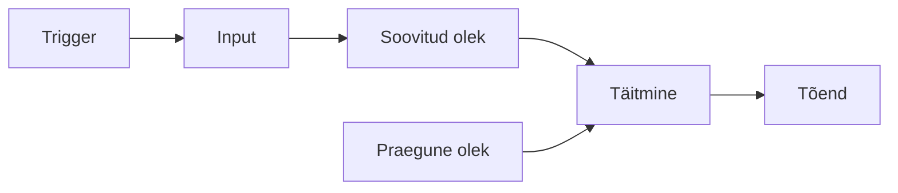

# K1 · Automatiseerimise mudel, deklaratiivsus ja idempotentsus

**Klassis:** kuni 30 min kahes plokis (§1 + §3, siis §4 + §5). §2 ja §6 loe kodus.

---

## 🎯 Õpiväljundid

Pärast seda materjali oskad:

- kirjeldada automatiseerimise üldmudelit (trigger → input → olek → täitmine → tõend) ja paigutada sinna ükskõik millise tööriista;
- eristada imperatiivset ja deklaratiivset lähenemist ning tuua näite, kus deklaratiivne asendab mitu käsku;
- selgitada idempotentsust ja miks see teeb korduva jooksu ohutuks;
- selgitada, mida Ansible tegelikult teeb, kui playbooki käivitad;
- nimetada, miks automatiseerimine vajab ohutusabinõusid, ja tuua näide blast radius'est.

---

## 1. Kaks administraatorit

Alice peab seadistama kolm veebiserverit jooksutama NGINX-i. Käsitsi tähendaks see igasse sisselogimist ja samade sammude kordamist: paigalda pakk, kirjuta konfifail, kopeeri sertifikaat, käivita teenus. Esimene server võtab pool tundi ja töötab. Kolmandaks korraks on aga üks samm ununenud või tehtud teises järjekorras, ja server nr 3 erineb kahest esimesest. Keegi ei märka seda, kuni ühel päeval käitub just tema teisiti.

Alice'i kolleeg kirjutab selle asemel ühe faili, Ansible'is nimega **playbook**, mis kirjeldab, millised hostid milliseks seada, ja jooksutab selle kõigi kolme peal korraga. Kolmas server on identne esimesega. Kui ta jooksutab sama faili homme uuesti, ei juhtu midagi, sest kõik on juba nii, nagu kirjeldatud. Vahe on korratavuses ja garantiis, kiirus on kõrvalnäht.

See kursus õpetab viisi süsteeme opereerida: versioonihallatud, korratav, jälgitav ja kontrollitud muutus. Ansible, Docker ja OpenTofu on selle mõtte kehastused eri kihtides. Enne ühtki tööriista alustame mudelist, mis kehtib neil kõigil, et uut tööriista ei peaks nullist pähe õppima.

## 2. Automatiseerimise üldmudel

Iga automatiseerimissüsteem, olgu see Bashi skript, Ansible, OpenTofu või CI-konveier, koosneb samadest osadest:



- **Trigger:** mis paneb selle käima? Inimene käsurealt, Git push, ajastus (cron), monitooringu häire, webhook. Sama playbook võib käivituda õppides käsitsi ja tööl pärast merge'i CI kaudu. Mootor on sama, käivitaja erinev.
- **Input:** kood, muutujad, inventar, saladused, parameetrid.
- **Soovitud olek:** mis peab olema.
- **Praegune olek:** mis tegelikult praegu on.
- **Täitmine:** mootor võrdleb soovitut praegusega ja teeb ainult vahe kinni.
- **Tõend:** logid, plaan, testitulemused, `changed`/`ok`, meetrikad. Automatiseerimine, mille tulemust keegi ei näe, on poolik, sest sa ei tea, kas see töötas.

Mudel teeb võõra tööriista loetavaks. Võta OpenTofu: trigger on `apply`, input on `.tf` failid, soovitud olek on ressursikirjeldus, praegune olek on state + päris infrastruktuur, täitmine on plaani rakendamine ja tõend on plaan ning `state list`. Sama raam sobib cron'ile, GitHub Actionsile ja Kubernetesele. Täna käsitleme soovitud olekut, täitmist ja tõendit ühel masinal. Järgmistel kohtumistel teeme sama mitmel masinal, konteinerites ja konveieris.

💭 **Kordamisküsimus:** võta cron-töö, mis teeb igal ööl varukoopia. Nimeta selle mudeli viis osa cron-töö puhul.

## 3. Käsklus vs soovitud olek

Vaata, kuidas looksid käsureal kausta õigete õiguste ja omanikuga. See on kolm eraldi sammu:

```bash
mkdir -p /etc/skel/.ssh
chown root:root /etc/skel/.ssh
chmod 700 /etc/skel/.ssh
```

Sina vastutad, et kõik kolm jooksevad ja õiges järjekorras. Ansible pakub sama tulemuse **ühe deklaratsioonina**:

```yaml
- name: .ssh kaust skeletonis
  ansible.builtin.file:
    path: /etc/skel/.ssh
    state: directory
    owner: root
    group: root
    mode: '0700'
```

Käsuloendis ütlesid, *kuidas*: kolm tegevust järjekorras. Deklaratsioonis ütlesid, *milline peab lõpptulemus olema*, ja `file`-moodul arvutab ise, mida teha. Kui kaust on olemas õigete õigustega, ei tee ta midagi. Kui õigused on valed, parandab ainult need. Kui kaust puudub, loob selle. Sa ei kirjuta `if`-e ega kontrolli olemasolu, seda teeb moodul.

See, et tööriist arvutab vahe ise, on põhjus, miks deklaratiivne lähenemine skaleerub. Käsuloend kasvab iga erijuhuga: mis siis, kui kaust on juba olemas, mis siis, kui õigused on pooleldi õiged? Deklaratsioon jääb samaks, sest kõiki neid juhte käsitleb moodul.

## 4. Idempotentsus

Deklaratiivsusest tuleb omadus, mis teeb korduva jooksu ohutuks. Vaata kasutaja tagamist:

```yaml
- name: Kasutaja deploy on olemas
  ansible.builtin.user:
    name: deploy
    group: web
```

Kui `deploy`-kasutajat pole, Ansible loob selle. Kui on juba olemas, ei tee midagi. Sama task üks kord või sada korda annab sama lõpptulemuse. Seda omadust nimetatakse **idempotentsuseks**.

See on tähtis, sest automatiseerimist jooksutatakse korduvalt ja iga kord peab olema ohutu:

- **ajastatult:** sama playbook käib igal ööl, et hoida masinaid joonel;
- **pärast katkestust:** jooks kukkus poole peal, jooksutad uuesti, ja idempotentne kirjeldus teeb ainult puuduva;
- **arenduses:** sama rolli jooksutad kümneid kordi.

Võrdle shell-skriptiga, kus on rida `useradd deploy`. Esimene jooks loob kasutaja. Teine jooks annab vea "user already exists", ja kui skript veakoode ei kontrolli, jätkab ta ülejäänud sammudega vales eelduses. Just see vaikne edasiminek pärast viga on ohtlik.

Ansible näitab idempotentsust nähtavalt. Esimene jooks värskes masinas annab mitu `changed`-i. Teine jooks kohe järel annab ainult `ok`-sid ja `changed=0`. See `changed=0` on idempotentsuse tõend. Kui keegi on masinas vahepeal käsitsi midagi muutnud, näitab järgmine jooks täpselt nii palju `changed`-e, kui palju oli triivinud, ja parandab ainult need. Nii on kirjeldus ühtlasi kontroll. Käsureal näed sama väikeses: `mkdir` annab teisel korral vea, `mkdir -p` mitte.

💭 **Kordamisküsimus:** miks on `useradd deploy` shell-skriptis ohtlikum kui Ansible'i `user`-task? Mis juhtub kummagagi teisel jooksul?

## 5. Mida Ansible tegelikult teeb

Kui jooksutad task'i, teeb Ansible iga hosti jaoks neli asja: **genereerib Python-skripti**, mis selle oleku saavutab, **kopeerib** selle üle SSH sihtmasinasse, **käivitab** seal ja **ootab**, kuni kõik hostid on valmis, enne kui järgmise task'i juurde liigub. Task'id jooksevad kõigil hostidel paralleelselt, aga sinu kirjutatud järjekorras.

Sellest kolm järeldust:

- **Agentless:** sihtmasinasse ei paigaldata püsivat tarkvara. Vaja on ainult SSH-d ja Pythonit. Pole agenti, mida hallata või uuendada, ega lisa-rünnakupinda.
- **Push:** sina käivitad käsu oma masinast (control node) ja muutus toimub kohe. Agendipõhises pull-mudelis (Chef, Puppet) muudad koodi, lükkad selle keskserverisse ja ootad, kuni agent ärkab ja muudatuse tõmbab. Ansible'is otsustad sina, millal muutus juhtub.
- **Kood kui dokumentatsioon:** playbook kirjeldab, kuidas teenus üles seada, ja erinevalt README-st ei vanane, sest see ongi kood, mis jookseb.

## 6. Ohutus

Automatiseerimine loob või hävitab sadu ressursse sekunditega, ja sama kiirusega levib viga. Käsitsi valest kaustast kustutamine kaotab ühe serveri andmed. Sama viga playbookis kaotab need kõigilt korraga.

Seepärast käib automatiseerimisega kaasas distsipliin, mis jookseb läbi kogu kursuse:

- **Ennusta, siis kontrolli:** enne muutust vaata dry-run'i või plaani (`--check`, `tofu plan`).
- **Blast radius:** testi ühel sihtmärgil enne kõiki (`--limit`).
- **Vähim õigus:** automaatikakonto saab teha ainult vajalikku; saladus ei jõua Giti ega logisse.
- **Rollback:** tea, kuidas eelmise töötava seisu juurde tagasi minna (Git revert, `destroy`, taaste).
- **Audit:** kes muutis, mida ja millal (Git + logid).

## Kokkuvõte

- **Mudel:** trigger → input → soovitud olek → praegune olek → täitmine → tõend. Kehtib igal tööriistal.
- **Deklaratiivne:** kirjeldad sihi, mitte samme. Üks `file`-task asendab `mkdir` + `chown` + `chmod`.
- **Idempotentne:** task annab sama tulemuse igal jooksul. `changed=0` teisel jooksul on tõend.
- **Mehaanika:** Python-skript → kopeeri üle SSH → käivita → oota kõiki. Agentless ja push.
- **Ohutus:** ennusta, blast radius, vähim õigus, rollback, audit.

Laboris näed idempotentsust käsureal, kirjutad esimese playbooki ja tõestad idempotentsust `changed`/`ok` väljundist.

---

## Allikad

- *Ansible: Up & Running*, 3. tr (O'Reilly 2022), ptk 1
- [Ansible: Getting started](https://docs.ansible.com/ansible/latest/getting_started/)
