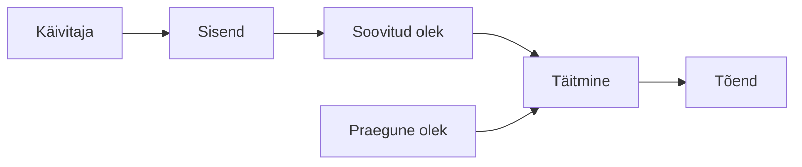
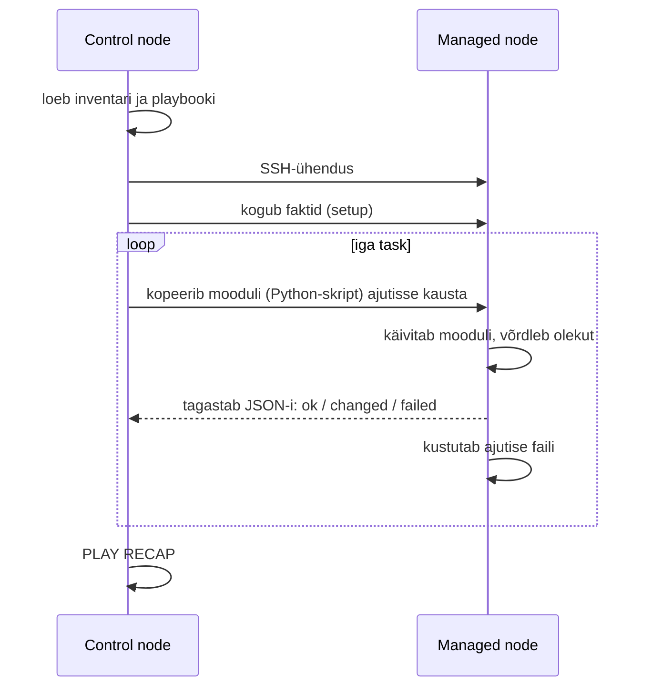
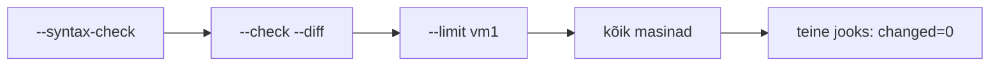

# K1 · Ansible alused: idempotentsus ja esimene playbook

**Kursus:** DevOps Lite
**Kestus:** klassis 2 × 15 min (§1, §4–5, §8); ülejäänu iseseisvaks lugemiseks (~2 h)
**Tase:** kesktase. Eeldame Linuxi käsurida, SSH-d, `sudo`-t, paketihaldust (`apt`/`dnf`) ja Giti baasi.

---

## 🎯 Õpiväljundid

Pärast seda loengut oskad:

- selgitada, miks käsitsi seadistatud serverid aja jooksul üksteisest erinema hakkavad, ja kirjeldada automatiseerimise üldmudelit;
- eristada käsku ja soovitud oleku kirjeldust ning põhjendada, miks moodul on idempotentne ja `command` mitte;
- kirjeldada, mida Ansible teeb, kui playbook käivitub: control node, SSH, Python, push-mudel, `forks`;
- kirjutada ja lugeda inventari, ad-hoc käske, playbooki ja `PLAY RECAP`-i;
- kasutada fakte ja muutujaid, et sama playbook töötaks eri distributsioonidel;
- valida ohutu töökäik muudatusele: `--syntax-check`, `--check --diff`, `--limit`, siis kõik masinad;
- seadistada võtmepõhise SSH-ligipääsu ja lahendada tüüpilised ühendusvead.

---

## 1. Kolm serverit ja üks unustatud samm

Väike Eesti e-pood valmistub jõulukampaaniaks. Seni on üks veebiserver, nüüd on vaja kolme. Administraator seadistab esimese käsitsi: loob teenusekasutaja, paigaldab nginx-i, kopeerib avalehe, lülitab teenuse sisse. Pool tundi ja töötab. Teine server läheb kiiremini, sest käsud on shelli ajaloos. Kolmanda juures helistab keegi vahele, ja `systemctl enable nginx` jääb tegemata.

Kõik kolm töötavad. Koormusjaotur saadab liiklust kõigile kolmele, testid on rohelised, kampaania läheb käima.

Kolm nädalat hiljem tehakse turvauuendusi ja serverid taaskäivitatakse. Kaks tulevad üles, kolmas mitte: nginx ei käivitu buutimisel, sest keegi ei lülitanud seda sisse. Koormusjaoturi tervisekontroll märkab, et üks server ei vasta, ja võtab selle rotatsioonist välja. Kampaania tipptunnil on kolmandik võimsusest puudu. Põhjuse leidmiseks kulub tund, sest "kõik serverid on ju samamoodi seadistatud".

Kolleeg lahendaks sama ülesande teisiti. Ta kirjutab ühe faili, mis ütleb: "neis kolmes masinas peab olema kasutaja `saidi`, pakett `nginx`, see avaleht, ja nginx peab käima ning buutimisel käivituma". Seejärel käivitab faili kõigi kolme vastu korraga. Kui homme lisandub neljas server, lisab ta inventari ühe rea. Kui keegi on vahepeal ühes masinas midagi muutnud, näitab järgmine käivitus täpselt, mis erines, ja parandab selle.

Sellel kursusel õpime seda teist töökäiku: süsteemi olek on kirjas koodis, kood on Gitis, ja iga muutus käib läbi koodi. Ansible on esimene tööriist, millega seda teeme, sest selle eeldused on kõige väiksemad. Sihtmasinas on vaja ainult SSH-d ja Pythonit, mis tavalises Linuxi serveris on juba olemas.

---

## 2. Konfiguratsiooni triiv

Eelmises loos kirjeldatud nähtust nimetatakse **konfiguratsiooni triiviks** (configuration drift): masinad, mis pidid olema identsed, erinevad üksteisest väikestes asjades, mida keegi ei märka enne, kui need midagi katki teevad.

Triivil on neli tüüpilist põhjust:

| Põhjus | Näide |
|---|---|
| unustatud samm | `systemctl enable` jäi tegemata |
| teine järjekord | konf kopeeriti enne paketti, pakett kirjutas selle üle |
| öine käsitsi parandus | `max_connections` tõsteti ühes masinas, teistes mitte |
| keegi ei pannud kirja | "Andres muutis midagi, aga ta on puhkusel" |

Triiv kasvab ajaga. Esimesel päeval on serverid peaaegu identsed. Pool aastat hiljem on igaühel oma ajalugu: erinevad paketiversioonid, käsitsi lisatud cron-read, ajutised failid, mis jäid alles. Selliseid servereid nimetatakse inglise keeles **snowflake server**: igaüks on ainulaadne, keegi ei tea täpselt, mis seal on, ja keegi ei julge seda uuesti paigaldada.

Vastupidine lähenemine on käsitleda servereid asendatavatena. Kui serveri olek on koodis kirjas, saab selle igal ajal uuesti ehitada, ja rikkis masina parandamise asemel saab selle asendada. Tööl tähendab see, et öine intsident lõpeb käsuga "ehita uus", mitte kolmetunnise veaotsinguga.

Triivi ei saa ära hoida käsitsi distsipliiniga. Inimesed unustavad, helistavad telefonid, on kiire. Triivi saab ära hoida ainult siis, kui masina olek on kirjas kohas, mis ei unusta, ja seda kirjeldust rakendatakse korduvalt.

---

## 3. Automatiseerimise üldmudel

Iga automatiseerimissüsteem, olgu see cron-skript, Ansible, Terraform, CI-konveier või Kubernetes, koosneb samadest osadest:



**Käivitaja** paneb protsessi käima: inimene käsurealt, `git push`, cron, monitooringu häire, webhook. **Sisend** on kood, muutujad, masinate nimekiri ja saladused. **Soovitud olek** on kirjeldus sellest, milline süsteem peab olema. **Praegune olek** on see, milline süsteem tegelikult on. **Täitmine** võrdleb kaht olekut ja teeb vahe kinni. **Tõend** on väljund, millest näed, mis juhtus: logi, plaan, testitulemus, Ansible'i `changed`/`ok`.

Mudelist on kasu, sest see teeb võõra tööriista loetavaks. Sama raam sobib kõigile tööriistadele, mida kursusel kasutame:

| Tööriist | Käivitaja | Soovitud olek | Praegune olek | Tõend |
|---|---|---|---|---|
| cron + shell | kellaaeg | skripti sisu | failisüsteem | logifail (kui keegi selle kirjutas) |
| Ansible | `ansible-playbook` | playbook | faktid + moodulite kontroll | `PLAY RECAP` |
| Docker Compose | `docker compose up` | `compose.yml` | jooksvad konteinerid | `docker compose ps` |
| GitHub Actions | `git push` | workflow-fail | repo sisu | roheline/punane job |
| Terraform | `terraform apply` | `.tf` failid | state + päris ressursid | `plan` väljund |
| Kubernetes | pidevalt | manifest | jooksvad Pod'id | `kubectl get` |

Tõend on osa, mis kõige sagedamini ununeb. Cron-skript, mis kirjutab vea `/dev/null`-i, on automatiseeritud, aga keegi ei tea, kas see töötab. Ansible annab tõendi igal jooksul, ja kursuse jooksul kasutame seda tõendit ka esitamiseks: `logid/teine_jooks.txt` failis olev `changed=0` näitab, et sinu kirjeldus on idempotentne.

**Kordamisküsimus:** võta cron-töö, mis teeb igal ööl andmebaasist varukoopia. Nimeta selle viis osa ülaltoodud mudeli järgi. Mis on selle töö puhul tõend, ja kas see on kuskil nähtav?

---

## 4. Käsk ja soovitud olek

Käsureal looksid kausta õigete õigustega nii:

```bash
mkdir -p /etc/skel/.ssh
chown root:root /etc/skel/.ssh
chmod 700 /etc/skel/.ssh
```

See on **imperatiivne** lähenemine: ütled, mida teha ja mis järjekorras. Sina vastutad, et kõik kolm sammu jooksevad ja et need jooksevad õiges masinas.

Ansible'is kirjeldad sama tulemust **deklaratiivselt**, ühe task'ina:

```yaml
- name: .ssh kaust skeletonis
  ansible.builtin.file:
    path: /etc/skel/.ssh
    state: directory
    owner: root
    group: root
    mode: "0700"
```

Siin ei ole ühtegi tegusõna. Task kirjeldab, milline kaust peab olema, ja `file`-moodul otsustab ise, mida teha. Kui kaust on olemas õigete õigustega, ei tee moodul midagi. Kui õigused on valed, parandab ainult õigused. Kui kausta pole, loob selle.

Vahe tuleb selgemini välja suurema näite puhul. Siin on shelli skript, mis püüab nginx-i paigaldamist teha ohutult korratavaks:

```bash
#!/usr/bin/env bash
set -euo pipefail

if ! id saidi >/dev/null 2>&1; then
    useradd -m saidi
fi

if ! dpkg -s nginx >/dev/null 2>&1; then
    apt-get update
    apt-get install -y nginx
fi

UUS="<h1>Hallatud</h1>"
if [ "$(cat /var/www/html/index.html 2>/dev/null)" != "$UUS" ]; then
    echo "$UUS" > /var/www/html/index.html
fi

systemctl is-enabled nginx >/dev/null 2>&1 || systemctl enable nginx
systemctl is-active nginx >/dev/null 2>&1 || systemctl start nginx
```

Skript töötab, aga ainult Debiani peres (`dpkg`, `apt-get`). See ei ütle, mida ta muutis ja mida mitte. Iga uus erijuht nõuab uut `if`-i. Sama playbookina:

```yaml
- name: Veebiserver
  hosts: veeb
  become: true
  tasks:
    - name: Kasutaja saidi on olemas
      ansible.builtin.user:
        name: saidi

    - name: nginx on paigaldatud
      ansible.builtin.package:
        name: nginx
        state: present

    - name: Avaleht on paigas
      ansible.builtin.copy:
        dest: /var/www/html/index.html
        content: "<h1>Hallatud</h1>\n"

    - name: nginx käib ja käivitub buutimisel
      ansible.builtin.service:
        name: nginx
        state: started
        enabled: true
```

Kõik kontrollid, mis skriptis olid `if`-idena, on moodulite sees. `package` töötab nii `apt` kui `dnf` peal. Väljundis näed iga rea kohta, kas see muutis midagi.

Tööl tähendab see, et playbooki loetakse nagu serveri kirjeldust. Uus kolleeg, kes tahab teada, kuidas veebiserverid on seadistatud, avab `bootstrap.yml`-i ega pea läbi käima kellegi shelli ajalugu.

---

## 5. Idempotentsus

Deklaratiivsusest tuleneb omadus, mida nimetatakse **idempotentsuseks**: sama operatsioon annab sama tulemuse, ükskõik mitu korda seda käivitad.

Vaata, mis juhtub, kui käivitad lihtsa shelli skripti kaks korda:

```bash
#!/usr/bin/env bash
useradd -m raporteerija
mkdir /srv/raport
echo "seade=1" >> /srv/raport/conf
```

Esimene jooks:

```
$ sudo bash halb.sh
$ cat /srv/raport/conf
seade=1
```

Teine jooks:

```
$ sudo bash halb.sh
useradd: user 'raporteerija' already exists
mkdir: cannot create directory '/srv/raport': File exists
$ cat /srv/raport/conf
seade=1
seade=1
```

Kaks esimest viga on vähemalt nähtavad. Kolmas rida viga ei anna: ta lisab faili teise rea `seade=1`. Kui rakendus loeb konfi ja kaks sama võtmega rida ajavad selle segadusse, on viga olemas, aga ükski logi seda ei näita.

Skripti saab idempotentseks teha, kui lisad iga sammu ette kontrolli:

```bash
#!/usr/bin/env bash
set -euo pipefail
id raporteerija >/dev/null 2>&1 || useradd -m raporteerija
mkdir -p /srv/raport
touch /srv/raport/conf
grep -qx 'seade=1' /srv/raport/conf || echo "seade=1" >> /srv/raport/conf
```

Kolmest reast sai viis, ja iga uus rida nõuab mõtlemist: mis on õige kontroll, mis juhtub, kui fail puudub. Ansible'i moodulid sisaldavad neid kontrolle juba:

```yaml
- ansible.builtin.user:
    name: raporteerija
- ansible.builtin.file:
    path: /srv/raport
    state: directory
- ansible.builtin.lineinfile:
    path: /srv/raport/conf
    line: seade=1
    create: true
```

Idempotentsus on vajalik, sest automatiseerimist käivitatakse korduvalt:

- **ajastatult**, et hoida masinaid joonel;
- **pärast katkestust**, kui eelmine jooks kukkus poole peal, ja idempotentne kirjeldus teeb ainult puuduva;
- **arenduse ajal**, kus sama playbooki jooksutad kümneid kordi järjest.

Iga kord peab jooks olema ohutu.

### Kuidas Ansible idempotentsust näitab

Iga task annab ühe tulemuse:

| Olek | Tähendus |
|---|---|
| `ok` | olek oli juba soovitud, midagi ei muudetud |
| `changed` | olek erines, moodul muutis seda |
| `failed` | task ebaõnnestus |
| `skipped` | task jäeti vahele (nt tingimus ei kehtinud või `--check` all `command`) |
| `unreachable` | masinani ei saadud ühendust |

Korralik playbook annab värskes masinas esimesel jooksul mitu `changed`-i ja teisel jooksul kohe järel `changed=0`. See `changed=0` on tõend, et kirjeldus on idempotentne.

### Kui task on igal jooksul `changed`

Kui mõni task on igal jooksul `changed`, ei kirjelda see olekut, vaid teeb tegevust. Tavaliselt on põhjus `command` või `shell` seal, kus oleks pidanud olema päris moodul:

```yaml
- name: Halb: igal jooksul changed
  ansible.builtin.command: useradd -m deploy
```

See task annab teisel jooksul isegi `failed`, sest `useradd` lõpetab veakoodiga. Kui moodulit tõesti pole, saab `command`-i teha idempotentseks kahel viisil. `creates` ütleb, et käsku pole vaja, kui fail on juba olemas:

```yaml
- name: Genereeri võti ainult siis, kui seda pole
  ansible.builtin.command: ssh-keygen -t ed25519 -N "" -f /etc/app/key
  args:
    creates: /etc/app/key
```

`changed_when` ütleb Ansible'ile, millal väljund tähendab muutust. Sellest räägime teisel kohtumisel.

**Kordamisküsimus:** miks on `useradd deploy` shelli skriptis ohtlikum kui `ansible.builtin.user: name=deploy`? Mis juhtub kummagagi teisel jooksul, ja kumma viga sa märkad?

---

## 6. Mida Ansible käivitamisel teeb

Ansible'i maailmas on kaks rolli. **Control node** on masin, kus Ansible on paigaldatud ja kust sa käske käivitad: sinu sülearvuti, WSL või hüppeserver. **Managed node** on masin, mida hallatakse. Managed node'is ei ole Ansible'it paigaldatud, seal on vaja ainult SSH-serverit ja Pythonit.

Kui käivitad playbooki, teeb Ansible iga task'i jaoks iga masinaga järgmist:



Sellest tulenevad omadused, mis mõjutavad kogu edasist tööd.

**Agentless.** Sihtmasinasse ei paigaldata püsivat teenust. Võrdle Puppeti või Chefiga, kus igas masinas jookseb agent, mida tuleb uuendada, jälgida ja turvata. Ansible'i puhul on rünnakupind see, mis serveris nagunii olemas on: SSH.

**Push.** Sina otsustad, millal muutus toimub, ja see toimub kohe. Agendipõhises pull-mudelis kirjutad muudatuse keskserverisse ja agent tõmbab selle järgmisel kontrollil, näiteks 30 minuti pärast. Push sobib hästi, kui tahad muutust näha ja kontrollida. Pull sobib paremini tuhandetele masinatele, mis peavad ise joonel püsima.

| | Ansible (push) | Puppet / Chef (pull) |
|---|---|---|
| Sihtmasinas | SSH + Python | agent (teenus) |
| Muutus toimub | kohe, kui käivitad | agendi järgmisel kontrollil |
| Keskserver | pole vaja | vaja (Puppet Server, Chef Server) |
| Sobib | kümned kuni sajad masinad, kontrollitud muudatused | tuhanded masinad, pidev joonel hoidmine |

**Task kõigil, siis järgmine task.** Task'id jooksevad kõigil masinatel paralleelselt, aga järjest: esimene task kõigil masinatel, siis teine task kõigil masinatel. Paralleelsust piirab `forks`, vaikimisi 5. Kui ühes masinas task ebaõnnestub, jätkavad teised, aga ebaõnnestunud masin jääb ülejäänud play'st välja.

**Faktid kogutakse alguses.** Enne esimest task'i käivitab Ansible igas masinas `setup`-mooduli, mis kogub info masina kohta. See võtab paar sekundit masina kohta. Kui fakte pole vaja, saab kogumise välja lülitada (`gather_facts: false`).

**Kordamisküsimus:** miks ei pea managed node'is Ansible paigaldatud olema? Mis peab seal siiski olema?

---

## 7. Paigaldamine ja `ansible.cfg`

Ansible paigaldatakse ainult control node'i. Levinumad viisid:

```bash
# Debian/Ubuntu distributsiooni pakett
sudo apt update && sudo apt install -y ansible

# RHEL/AlmaLinux
sudo dnf install -y ansible-core

# pipx: kasutaja kodukausta, distributsioonist sõltumatu versioon
pipx install --include-deps ansible
```

`ansible-core` on mootor ja väike hulk sisseehitatud mooduleid (`ansible.builtin`). Pakett `ansible` sisaldab lisaks kollektsioone, näiteks `ansible.posix` ja `community.general`. Sellel kursusel piisab `ansible` paketist.

```bash
ansible --version
```

Väljundis on versioon, Pythoni versioon ja see, millist konfiguratsioonifaili kasutatakse.

### `ansible.cfg`

Ansible otsib seadistusfaili selles järjekorras ja kasutab esimest, mille leiab:

1. keskkonnamuutuja `ANSIBLE_CONFIG`;
2. `ansible.cfg` jooksvas kaustas;
3. `~/.ansible.cfg`;
4. `/etc/ansible/ansible.cfg`.

Praktiline on hoida `ansible.cfg` projekti kaustas, siis on seaded koos koodiga Gitis:

```ini
[defaults]
inventory = inventory.ini
forks = 10
host_key_checking = True
stdout_callback = yaml

[ssh_connection]
pipelining = True
```

`inventory` lubab jätta käsust `-i inventory.ini` ära. `pipelining` vähendab SSH-ühenduste arvu ja kiirendab jooksu märgatavalt. `stdout_callback = yaml` teeb vigade väljundi loetavamaks.

⚠️ Kui `ansible.cfg` on kaustas, kuhu kõigil on kirjutusõigus (maailmaloetav kaust), ignoreerib Ansible seda turvakaalutlustel ja annab hoiatuse. WSL-is juhtub see, kui töötad Windowsi kettal (`/mnt/c/...`). Hoia töökaust Linuxi failisüsteemis, näiteks `~/`.

---

## 8. Inventar

**Inventar** on nimekiri masinatest, mida haldad. Kõige lihtsam kuju on INI-fail:

```ini
[kohalik]
localhost ansible_connection=local

[veeb]
vm1
vm2
vm3
```

Nurksulgudes on **grupid**. Iga masin võib olla mitmes grupis. Alati on olemas kaks sisseehitatud gruppi: `all` (kõik masinad) ja `ungrouped` (masinad, mis pole üheski grupis).

`ansible_connection=local` ütleb, et selle masinaga ei ühenduta üle SSH, vaid käsud käivitatakse otse. Nii saad esimese playbooki proovida oma masinas ilma ühtki serverit seadistamata.

### Ühenduse muutujad

Masina rea järele saab kirjutada muutujaid, mis ütlevad, kuidas masinaga ühenduda:

```ini
[veeb]
vm1 ansible_host=192.168.35.21 ansible_user=kasutaja
vm2 ansible_host=192.168.35.22 ansible_user=kasutaja
vm3 ansible_host=192.168.35.23 ansible_user=kasutaja ansible_port=2222
```

| Muutuja | Tähendus |
|---|---|
| `ansible_host` | IP või DNS-nimi, kuhu ühenduda |
| `ansible_user` | SSH kasutajanimi |
| `ansible_port` | SSH port, vaikimisi 22 |
| `ansible_connection` | `ssh` (vaikimisi) või `local` |
| `ansible_python_interpreter` | Pythoni asukoht sihtmasinas, kui automaatne tuvastus ei tööta |

Puhtam lahendus on hoida ühenduse andmed `~/.ssh/config`-is (vt §15). Siis on inventaris ainult nimed, ja sama `ssh vm1` töötab nii käsurealt kui Ansible'ist.

### YAML-kujul inventar

Sama inventar YAML-is:

```yaml
all:
  children:
    kohalik:
      hosts:
        localhost:
          ansible_connection: local
    veeb:
      hosts:
        vm1:
        vm2:
        vm3:
```

INI on lühem ja sobib väikestele inventaridele. YAML sobib, kui gruppe ja muutujaid on palju. Teisel kohtumisel kasutame gruppide pesastamist (`children`) ja grupimuutujaid.

### Inventari kontrollimine

Enne esimest jooksu tasub vaadata, kuidas Ansible inventari mõistab:

```bash
ansible-inventory -i inventory.ini --graph
```

```
@all:
  |--@ungrouped:
  |--@kohalik:
  |  |--localhost
  |--@veeb:
  |  |--vm1
  |  |--vm2
  |  |--vm3
```

`--list` näitab sama JSON-ina koos kõigi muutujatega.

### Sihtimine ja mustrid

Masinaid saab valida grupi, nime või mustri järgi:

| Muster | Valib |
|---|---|
| `all` | kõik masinad |
| `veeb` | grupi `veeb` |
| `vm1` | ühe masina |
| `vm1:vm2` | mõlemad |
| `veeb:!vm3` | grupi `veeb` ilma `vm3`-ta |
| `veeb:&test` | masinad, mis on nii `veeb`- kui `test`-grupis |
| `vm*` | kõik, mille nimi algab `vm` |

Playbookis on muster rea `hosts:` väärtus. Käsureal lisab `--limit` piirangu playbooki `hosts:` peale:

```bash
ansible-playbook bootstrap.yml --limit vm1
ansible-playbook bootstrap.yml --limit 'veeb:!vm3'
```

Tööl on inventar tavaliselt jagatud keskkondade kaupa (`test`, `prod`) ja rollide kaupa (`veeb`, `andmebaas`, `koormusjaotur`). Teisel kohtumisel lisame gruppidele muutujad, nii et sama playbook seadistab test- ja toodangukeskkonna erinevalt.

---

## 9. Ad-hoc käsud

Ad-hoc käsk käivitab ühe mooduli ühe korra ilma playbookita. Süntaks:

```
ansible <muster> -i <inventar> -m <moodul> -a "<argumendid>" [-b]
```

`-b` (`--become`) käivitab mooduli `sudo` kaudu.

| Eesmärk | Käsk |
|---|---|
| kas masinad vastavad | `ansible veeb -m ping` |
| faktid | `ansible vm1 -m setup -a "filter=ansible_distribution*"` |
| kettaruum | `ansible veeb -m command -a "df -h /"` |
| paketi paigaldamine | `ansible veeb -b -m package -a "name=htop state=present"` |
| teenuse taaskäivitus | `ansible veeb -b -m service -a "name=nginx state=restarted"` |
| faili kopeerimine | `ansible veeb -b -m copy -a "src=motd dest=/etc/motd"` |
| kasutaja eemaldamine | `ansible veeb -b -m user -a "name=vana state=absent"` |

`ping`-moodul ei saada ICMP-paketti. See ühendub SSH-ga, käivitab sihtmasinas Pythoni ja vastab `pong`, kui kõik töötab. Seega kontrollib `ping` korraga ühendust, autentimist ja Pythoni olemasolu.

```
vm1 | SUCCESS => {
    "changed": false,
    "ping": "pong"
}
```

Ad-hoc käsud sobivad küsimustele ("mis versioon kõigis masinates on?") ja ühekordsetele toimingutele ("taaskäivita teenus kohe"). Kõik, mis peab olema korratav või mida tahad Gitis hoida, käib playbooki.

---

## 10. YAML lühidalt

Playbookid on YAML-failid. YAML-i süntaksiviga on algaja kõige sagedasem takistus, seega tasub põhireeglid teada.

**Taane loeb.** Struktuuri määravad tühikud, mitte sulud. Kasuta alati tühikuid, mitte tabulaatorit. Kursusel kasutame taanet 2 tühikut.

**Loend** algab kriipsuga:

```yaml
paketid:
  - htop
  - curl
  - git
```

**Sõnastik** on võti-väärtus paarid:

```yaml
kasutaja:
  nimi: deploy
  shell: /bin/bash
```

**Loend sõnastikest** on playbookis kõige levinum kuju. Iga task on üks loendi element:

```yaml
tasks:
  - name: Esimene task
    ansible.builtin.ping:

  - name: Teine task
    ansible.builtin.debug:
      msg: tere
```

**Jutumärgid** on vajalikud, kui väärtus algab `{`-ga (Jinja2 muutuja), sisaldab `:` järel tühikut või peab jääma stringiks:

```yaml
mode: "0644"                    # ilma jutumärkideta loetakse kaheksandarvuks
sisu: "{{ inventory_hostname }}" # algab {-ga
pealkiri: "Viga: fail puudub"    # koolon + tühik
```

**Tõeväärtused** kirjuta kujul `true` ja `false`. YAML aktsepteerib ka `yes`, `no`, `on`, `off`, aga `ansible-lint` hoiatab nende eest.

Tüüpilised veateated:

| Veateade | Põhjus |
|---|---|
| `mapping values are not allowed in this context` | koolon + tühik väärtuses ilma jutumärkideta |
| `found character '\t' that cannot start any token` | tabulaator taandes |
| `did not find expected '-' indicator` | loendi elemendi taane on vale |
| `We were unable to read either as JSON nor YAML` | fail pole korrektne YAML, sageli taane |
| `this task has extra params` | mooduli parameeter on vale taandega |

Enne esimest jooksu kontrolli süntaksit:

```bash
ansible-playbook bootstrap.yml --syntax-check
```

---

## 11. Moodulid ja toores käsk

**Moodul** on väike programm, mis teab, kuidas ühte liiki ressurssi hallata. Moodul kontrollib enne muutmist praegust olekut ja tagastab struktureeritud tulemuse.

Kursuse esimestel kohtumistel kasutad neid mooduleid:

| Moodul | Mida haldab | Olulised parameetrid |
|---|---|---|
| `ansible.builtin.user` | kasutaja | `name`, `groups`, `append`, `shell`, `state` |
| `ansible.builtin.group` | grupp | `name`, `state` |
| `ansible.builtin.package` | pakett, OS-ist sõltumatult | `name`, `state` (`present`, `absent`, `latest`) |
| `ansible.builtin.apt` / `dnf` | pakett, konkreetne haldur | `name`, `state`, `update_cache` |
| `ansible.builtin.copy` | fail sisuga või kopeeritud failist | `dest`, `src` või `content`, `mode`, `owner` |
| `ansible.builtin.file` | kaust, õigused, link, kustutamine | `path`, `state`, `mode`, `owner` |
| `ansible.builtin.lineinfile` | üks rida failis | `path`, `line`, `regexp`, `create` |
| `ansible.builtin.service` | teenus | `name`, `state`, `enabled` |
| `ansible.builtin.cron` | cron-töö | `name`, `minute`, `hour`, `job` |
| `ansible.builtin.fetch` | fail sihtmasinast control node'i | `src`, `dest`, `flat` |
| `ansible.posix.authorized_key` | SSH avalik võti kasutajale | `user`, `key` |
| `ansible.builtin.debug` | väljund jooksu ajal | `msg`, `var` |

`command` ja `shell` käivitavad lihtsalt käsu. Nad ei tea, mida käsk teeb, ega saa seega öelda, kas midagi muutus. Seetõttu märgivad nad end vaikimisi alati `changed`-ks.

Vahe `command` ja `shell` vahel: `command` käivitab programmi otse, ilma shellita, seega ei tööta seal torud (`|`), ümbersuunamised (`>`) ega muutujad (`$HOME`). `shell` käivitab käsu läbi `/bin/sh`, ja kõik see töötab. `command` on ohutum, sest shelli erimärgid ei saa seal midagi ootamatut teha.

| Ülesanne | Käsk | Moodul |
|---|---|---|
| kasutaja olemas | `useradd deploy` | `ansible.builtin.user` |
| pakett paigaldatud | `apt install nginx` | `ansible.builtin.package` |
| fail sisuga | `echo … > fail` | `ansible.builtin.copy` |
| rida konfis | `echo … >> conf` | `ansible.builtin.lineinfile` |
| teenus käib | `systemctl start nginx` | `ansible.builtin.service` |
| õigused | `chmod 600 fail` | `ansible.builtin.file` |

Reegel on lihtne: kui moodul on olemas, kasuta moodulit. `command`/`shell` jäävad käskudele, millele moodulit pole, või ainult lugemiseks mõeldud käskudele.

### FQCN ja `ansible-doc`

Mooduli nimed kirjutame täiskujul (FQCN, fully qualified collection name): `ansible.builtin.copy`, mitte lihtsalt `copy`. Lühike kuju töötab, aga täiskuju ütleb üheselt, millisest kollektsioonist moodul pärit on, ja `ansible-lint` nõuab seda.

Mooduli parameetrid leiad käsurealt:

```bash
ansible-doc ansible.builtin.service      # täielik kirjeldus koos näidetega
ansible-doc -s ansible.builtin.copy      # lühikokkuvõte, sobib kopeerimiseks
ansible-doc -l | grep -i cron            # otsi mooduleid nime järgi
```

`ansible-doc` väljundi lõpus on alati jaotis `EXAMPLES`, kust saad tööva näite. Keegi ei mäleta kõiki parameetreid peast, ja tööl kasutad `ansible-doc`-i iga päev.

---

## 12. `become`: administraatori õigused

Paljud moodulid vajavad root-õigusi: pakettide paigaldamine, teenuste haldamine, failid `/etc` all. Ansible ühendub tavakasutajana ja tõstab õigusi `sudo` kaudu, kui ütled:

```yaml
- name: Veebiserver
  hosts: veeb
  become: true
```

`become: true` play tasemel kehtib kõigile task'idele. Seda saab panna ka üksikule task'ile, kui ülejäänud töö ei vaja root-õigusi.

Kui sihtmasinas nõuab `sudo` parooli, lisa käsule `-K` (`--ask-become-pass`):

```bash
ansible-playbook bootstrap.yml -K
```

Ansible küsib parooli üks kord ja kasutab seda kõigis masinates. Kui masinatel on erinevad paroolid, see ei tööta. Laborites on kasutajal tavaliselt paroolita sudo:

```
kasutaja ALL=(ALL) NOPASSWD: ALL
```

Toodangus eelistatakse eraldi automaatikakontot, kellel on paroolita sudo ainult vajalikele käskudele. Vähima õiguse põhimõttest räägime Vaulti juures teisel kohtumisel.

`become_user` võimaldab käivitada task'i mõne teise kasutajana kui root, näiteks andmebaasi kasutajana:

```yaml
- name: Andmebaasi varukoopia
  ansible.builtin.command: pg_dumpall -f /tmp/dump.sql
  become: true
  become_user: postgres
```

---

## 13. Faktid ja muutujad

Enne esimest task'i kogub Ansible igast masinast **fakte** (facts): OS, distributsioon, IP-aadressid, mälu, ketaste info ja palju muud.

```bash
ansible vm1 -m setup
ansible vm1 -m setup -a "filter=ansible_os_family"
ansible vm1 -m setup -a "filter=ansible_default_ipv4"
```

Kõige sagedamini vajad neid:

| Fakt | Näide väärtusest |
|---|---|
| `ansible_os_family` | `Debian`, `RedHat` |
| `ansible_distribution` | `Ubuntu`, `AlmaLinux` |
| `ansible_distribution_version` | `24.04`, `9.4` |
| `ansible_hostname` | `hkhk-vm-17` |
| `ansible_default_ipv4.address` | `192.168.35.21` |
| `ansible_memtotal_mb` | `3915` |
| `ansible_processor_vcpus` | `2` |

Faktid muutuvad playbookis muutujateks. Lisaks on **maagilised muutujad**, mida Ansible annab alati, ka ilma faktideta. Olulisim neist on `inventory_hostname`: masina nimi inventaris.

`inventory_hostname` (`vm1`) ja `ansible_hostname` (`hkhk-vm-17`) võivad erineda. Inventari nimi on sinu kontrolli all, masina hostname mitte. Seepärast kasutame kursusel sildiks `inventory_hostname`-i.

### Jinja2

Muutujaid kasutatakse **Jinja2** süntaksiga, topeltloogeliste sulgude vahel:

```yaml
- name: Avaleht näitab masina nime
  ansible.builtin.copy:
    dest: /var/www/html/index.html
    content: "<h1>{{ inventory_hostname }}</h1>\n"
```

Jinja2 lubab lihtsaid tingimusi ja filtreid:

```yaml
vars:
  veebi_juur: "{{ '/var/www/html' if ansible_os_family == 'Debian' else '/usr/share/nginx/html' }}"
  sudo_grupp: "{{ 'sudo' if ansible_os_family == 'Debian' else 'wheel' }}"
  keskkond: "{{ env | default('test') }}"
  pealkiri: "{{ inventory_hostname | upper }}"
```

`default` annab väärtuse, kui muutujat pole defineeritud. `upper` teeb suurtähed. Filtreid on sadu, ja teisel kohtumisel kasutame neid mallides.

Näide lahendab probleemi, mis tekib kohe, kui masinad pole ühesugused: nginx serveerib Debiani peres faile kaustast `/var/www/html`, RedHati peres kaustast `/usr/share/nginx/html`. Sudo-grupi nimi on Debianis `sudo`, RedHatis `wheel`. Playbook ei tea, mis masinas ta on, enne kui faktid on kogutud. Pärast seda valib ta õige väärtuse ise.

### `debug` ja muutujate vaatamine

Kui pole kindel, mis väärtus muutujal on, näita seda:

```yaml
- name: Näita, mis juurkaust valiti
  ansible.builtin.debug:
    var: veebi_juur
```

```
ok: [vm1] => {
    "veebi_juur": "/var/www/html"
}
ok: [vm2] => {
    "veebi_juur": "/usr/share/nginx/html"
}
```

Tööl hoiab see sind eemal kahest halvast lahendusest: iga distributsiooni jaoks eraldi playbook, või `if`-id shelli skriptis. Üks playbook fakti järgi valitud väärtustega on hallatav ka siis, kui masinapargis on kolm eri OS-i.

---

## 14. Playbooki anatoomia ja käivitamine

Playbook on YAML-fail, milles on üks või mitu **play**'d. Play seob masinad ja task'id:

```yaml
- name: Bootstrap veebiserver        # play nimi
  hosts: veeb                        # millistele masinatele
  become: true                       # sudo kõigile task'idele
  gather_facts: true                 # vaikimisi true
  vars:                              # muutujad
    veebi_juur: "{{ '/var/www/html' if ansible_os_family == 'Debian' else '/usr/share/nginx/html' }}"
  tasks:                             # mida teha, järjekorras
    - name: Kasutaja saidi on olemas
      ansible.builtin.user:
        name: saidi

    - name: nginx on paigaldatud
      ansible.builtin.package:
        name: nginx
        state: present

    - name: Avaleht näitab masina nime
      ansible.builtin.copy:
        dest: "{{ veebi_juur }}/index.html"
        content: "<h1>{{ inventory_hostname }}</h1>\n"

    - name: nginx käib ja käivitub buutimisel
      ansible.builtin.service:
        name: nginx
        state: started
        enabled: true
```

Iga task'i `name` on see, mida näed väljundis. Kirjuta nimi soovitud olekuna ("nginx on paigaldatud"), mitte tegevusena ("paigalda nginx"). Nii loetakse väljundit nagu kontrollnimekirja.

Ühes failis võib olla mitu play'd, näiteks üks andmebaasidele ja teine veebiserveritele. Need käivitatakse järjest.

### Käivitamise võtmed

| Käsk | Mida teeb |
|---|---|
| `ansible-playbook p.yml --syntax-check` | kontrollib ainult YAML-i ja struktuuri |
| `ansible-playbook p.yml --list-hosts` | näitab, milliseid masinaid play puudutaks |
| `ansible-playbook p.yml --list-tasks` | näitab task'ide nimekirja |
| `ansible-playbook p.yml --check --diff` | kuiv jooks, näitab muudatusi |
| `ansible-playbook p.yml --limit vm1` | ainult ühele masinale |
| `ansible-playbook p.yml --start-at-task "nginx on paigaldatud"` | alusta kindlast task'ist |
| `ansible-playbook p.yml -v` / `-vvv` | rohkem väljundit; `-vvv` näitab SSH-ühendust |

Veaotsingul alusta alati `-v`-st. `-vvv` näitab, milliste parameetritega SSH ühendus luuakse, ja see lahendab enamiku ühendusvigu.

### Väljundi lugemine

Jooks näeb välja nii:

```
PLAY [Bootstrap veebiserver] **********************************

TASK [Gathering Facts] ****************************************
ok: [vm1]
ok: [vm2]

TASK [Kasutaja saidi on olemas] *******************************
ok: [vm1]
changed: [vm2]

TASK [nginx on paigaldatud] ***********************************
ok: [vm1]
ok: [vm2]
```

Iga task'i all on iga masina tulemus. Jooksu lõpus on kokkuvõte:

```
PLAY RECAP ****************************************************
vm1  : ok=5  changed=0  unreachable=0  failed=0  skipped=0
vm2  : ok=5  changed=1  unreachable=0  failed=0  skipped=0
vm3  : ok=0  changed=0  unreachable=1  failed=0  skipped=0
```

Siit loed kolm asja: `vm1` on soovitud olekus; `vm2`-s oli üks erinevus, mis parandati; `vm3`-ga ei saadud ühendust, seega ei tea sa selle olekust midagi. Viimane on rida, mida kõige kergemini tähelepanuta jäetakse, sest `changed=0` on seal ka.

---

## 15. SSH-võtmed ja ligipääs

Ansible ühendub masinatega tavalise OpenSSH-kliendiga. Et playbook saaks töötada ilma, et iga masina juures parooli küsitaks, kasutame võtmepõhist autentimist.

### Võtmepaar

Võtmepaar koosneb kahest failist. **Privaatvõti** (`~/.ssh/id_ed25519`) jääb control node'i ja ei lahku sealt kunagi. **Avalik võti** (`~/.ssh/id_ed25519.pub`) kopeeritakse igasse masinasse, kuhu tahad siseneda, faili `~/.ssh/authorized_keys`. Ühendumisel tõestab klient, et tal on avalikule võtmele vastav privaatvõti, ja parooli ei küsita.

```bash
ssh-keygen -t ed25519 -C "maria@kursus"
```

`ed25519` on tänapäevane vaikevalik: lühike võti, kiire ja turvaline. RSA võtmeid kohtad vanemates süsteemides, siis vähemalt 3072 bitti.

Võtmele saab panna parooli (passphrase). See kaitseb võtit, kui fail varastatakse, aga siis küsitakse parooli igal kasutamisel. Lahendus on `ssh-agent`, mis hoiab lahtikrüptitud võtit mälus kuni sessiooni lõpuni:

```bash
eval "$(ssh-agent -s)"
ssh-add ~/.ssh/id_ed25519
```

### Avaliku võtme kopeerimine

```bash
ssh-copy-id -i ~/.ssh/id_ed25519.pub kasutaja@192.168.35.21
ssh kasutaja@192.168.35.21 hostname
```

`ssh-copy-id` küsib esimesel korral parooli, sest võtit veel pole. Pärast seda enam mitte.

Kui `ssh-copy-id` pole saadaval (näiteks Windowsi PowerShellis), teeb sama:

```bash
cat ~/.ssh/id_ed25519.pub | ssh kasutaja@192.168.35.21 \
  "mkdir -p ~/.ssh && chmod 700 ~/.ssh && cat >> ~/.ssh/authorized_keys && chmod 600 ~/.ssh/authorized_keys"
```

SSH-server on õiguste suhtes range. Kui `~/.ssh` või `authorized_keys` on teistele kirjutatav, ignoreerib server võtit ja küsib parooli.

### `~/.ssh/config`

`~/.ssh/config` lubab anda masinatele lühikesed nimed ja määrata kasutaja ning võtme:

```
Host vm1
    HostName 192.168.35.21
    User kasutaja
    IdentityFile ~/.ssh/id_ed25519

Host vm2
    HostName 192.168.35.22
    User kasutaja
    IdentityFile ~/.ssh/id_ed25519

Host vm*
    ServerAliveInterval 30
```

Nüüd töötab `ssh vm1`, ja kuna Ansible kasutab sama SSH-klienti, töötab ka inventaris lihtsalt `vm1`. Viimane plokk kehtib kõigile, kelle nimi algab `vm`-ga.

### `known_hosts`

Esimesel ühendumisel küsib SSH, kas usaldad masina võtit (host key), ja salvestab selle faili `~/.ssh/known_hosts`. Kui masin hiljem uuesti paigaldatakse, võti muutub ja SSH keeldub ühendumast:

```
@@@@@@@@@@@@@@@@@@@@@@@@@@@@@@@@@@@@@@@@@@@@@@@@@@@@@@@@@@@
@    WARNING: REMOTE HOST IDENTIFICATION HAS CHANGED!     @
@@@@@@@@@@@@@@@@@@@@@@@@@@@@@@@@@@@@@@@@@@@@@@@@@@@@@@@@@@@
```

Laborikeskkonnas, kus VM-e ehitatakse uuesti, eemaldad vana kirje:

```bash
ssh-keygen -R vm1
ssh-keygen -R 192.168.35.21
```

Toodangus on see hoiatus põhjus peatuda ja uurida, sest see võib tähendada, et keegi on ühenduse vahele.

Ansible küsib samuti host key kinnitust, ja kui masinaid on palju, peatub jooks iga uue masina juures. Selle vältimiseks ühendu esimest korda käsitsi (`ssh vm1 hostname`) või kogu võtmed ette:

```bash
ssh-keyscan vm1 vm2 vm3 >> ~/.ssh/known_hosts
```

⚠️ `host_key_checking = False` `ansible.cfg`-s lülitab kontrolli välja. Laboris on see mugav, toodangus mitte.

⚠️ Privaatvõti ei käi Giti, ei käi jagatud kausta ega saadeta vestlusesse. Kui see lekib, loo uus võtmepaar ja eemalda vana avalik võti kõigist `authorized_keys` failidest. Esimese kodutöö harjutus H1 teeb seda Ansible'iga.

### Tüüpilised SSH-vead

| Veateade | Põhjus | Lahendus |
|---|---|---|
| `Permission denied (publickey)` | avalik võti pole sihtmasinas või vale kasutaja | korda `ssh-copy-id`; kontrolli `User` |
| `Connection refused` | SSH-server ei käi või vale port | `systemctl status ssh` sihtmasinas; `ansible_port` |
| `Connection timed out` | masin pole võrgus või tulemüür | `ping`, VPN, tulemüüri reeglid |
| `Host key verification failed` | host key muutus | `ssh-keygen -R vm1` |
| `UNREACHABLE` Ansible'is | üks ülaltoodutest | `ssh vm1 hostname` käsitsi, siis `-vvv` |
| `Missing sudo password` | sudo nõuab parooli | `-K` või paroolita sudo |

---

## 16. Ohutu muudatus

Automatiseerimine teeb muudatuse kõigis masinates sekunditega, ja sama kiirusega levib viga. Käsitsi tehtud viga rikub ühe serveri. Sama viga playbookis rikub kõik. Seepärast käib iga muudatus läbi samade sammude:



### Kuiv jooks: `--check --diff`

`--check` käivitab playbooki kuivalt: moodulid ütlevad, mida nad teeksid, aga ei muuda midagi. `--diff` näitab failide puhul vana ja uue sisu vahet:

```
TASK [Avaleht näitab masina nime] *****************************
--- before: /var/www/html/index.html
+++ after: /var/www/html/index.html
@@ -1 +1 @@
-<h1>Tere käsitsi</h1>
+<h1>vm1</h1>
changed: [vm1]
```

Dry run'il on piirangud. `command`- ja `shell`-task'id jäetakse vahele, sest Ansible ei tea, mida need teeksid. Kui hilisem task sõltub eelmise task'i tegelikust tulemusest (näiteks pakett peab olema paigaldatud, et teenust käivitada), võib dry run anda vea, mida päris jooksul ei tuleks. Dry run on hea ülevaade, mitte garantii.

### Mõjuala: `--limit`

**Blast radius** (mõjuala) on see, kui palju süsteemist üks viga katki teeb. `--limit` hoiab mõjuala ühe masina suurusena, kuni oled kindel, et muudatus töötab:

```bash
ansible-playbook bootstrap.yml --limit vm1
curl -s http://vm1
ansible-playbook bootstrap.yml
```

Suuremates keskkondades kasutatakse `serial`-it, mis rakendab muudatust partiidena (näiteks 2 masinat korraga) ja peatub, kui partii ebaõnnestub. Sellest räägime teisel kohtumisel.

### Drift ja kontroll

**Drift** tekib, kui keegi muudab masinat käsitsi: peatab teenuse, parandab konfi, kustutab faili. Järgmine playbooki jooks näitab iga triivinud asja `changed`-ina ja taastab soovitud oleku.

Selles mõttes on playbook ka kontrollvahend. Kui käivitad selle ajastatult `--check` režiimis, saad igal ööl nimekirja masinatest, mis on soovitud olekust eemale triivinud:

```bash
ansible-playbook bootstrap.yml --check > drift-$(date +%F).log
grep -q 'changed=[1-9]' drift-$(date +%F).log && echo "Drift leitud"
```

Päris keskkonnas käivitaks selle CI-konveier või AWX/Ansible Automation Platform ja teade läheks meeskonna kanalisse. Neljandal kohtumisel ehitame konveieri, mis teeb sarnast kontrolli igal push'il.

### Ohutuse kontrollnimekiri

Iga muudatuse juures:

- **ennusta:** kirjuta üles, mitu `changed`-i ootad ja kus;
- **vaata enne:** `--check --diff`;
- **piira mõjuala:** `--limit` ühe masinaga;
- **tõenda:** teine jooks `changed=0` kõigil, `unreachable=0`;
- **pane kirja:** muudatus käib Giti, commit-sõnum ütleb miks.

**Kordamisküsimus:** kolleeg ütleb, et `--check` on aeglane ja ta jätab selle vahele, sest "playbook on ju testitud". Millise olukorra puhul läheb see valesti? Ja millal näitab `--check` ise valesti?

---

## 17. Tüüpilised vead esimesel päeval

| Sümptom | Tõenäoline põhjus | Kontroll |
|---|---|---|
| `ansible: command not found` | Ansible pole paigaldatud või `PATH`-is | `pipx list`, `which ansible` |
| hoiatus `ansible.cfg` ignoreeritakse | töökaust on Windowsi kettal (WSL) | tööta `~/`-s |
| `Could not match supplied host pattern` | grupp puudub inventaris või vale `-i` | `ansible-inventory --graph` |
| `mapping values are not allowed` | YAML: koolon väärtuses | jutumärgid |
| `couldn't resolve module/action` | mooduli nimi vale või kollektsioon puudub | `ansible-doc -l \| grep …` |
| `Permission denied` task'is | `become: true` puudub | lisa play tasemele |
| `Could not get lock /var/lib/dpkg/lock` | taustal käib teine apt | oota, korda |
| task on igal jooksul `changed` | `command`/`shell` mooduli asemel | vaheta moodul |
| `curl` näitab vaikelehte | fail läks vale kausta | `debug: var=veebi_juur` |
| `UNREACHABLE` | SSH | `ssh vm1 hostname`, siis `-vvv` |

Veaotsingu järjekord on alati sama: loe veateadet algusest lõpuni, korda käsku `-v`-ga, proovi sama asja käsitsi sihtmasinas. Enamik vigu on kirjas veateate esimeses reas.

---

## 18. Kokkuvõte

**Triiv tekib alati, kui masinaid seadistatakse käsitsi.** Kaitse selle vastu on kirjeldus koodis, mida käivitatakse korduvalt.

**Deklaratiivne task kirjeldab olekut, moodul otsustab tegevuse.** `command`/`shell` ainult siis, kui moodulit pole.

**`changed=0` teisel jooksul on idempotentsuse tõend.** Task, mis on igal jooksul `changed`, teeb tegevust ega kirjelda olekut.

**Ansible on agentless ja push-põhine.** Control node ühendub SSH-ga, kopeerib mooduli, käivitab selle ja saab JSON-i tagasi.

**Inventar ütleb kus, playbook ütleb mis, faktid ütlevad, milline masin on.** `ansible_os_family` järgi saab üks playbook teenindada eri distributsioone.

**Võtmepõhine SSH on eeldus.** Privaatvõti jääb control node'i, avalik võti läheb `authorized_keys`-i, lühinimed tulevad `~/.ssh/config`-ist.

**Ohutu muudatus:** `--syntax-check` → `--check --diff` → `--limit` → kõik → teine jooks. `unreachable` rida `PLAY RECAP`-is tähendab, et selle masina olekut sa ei tea.

---

## Allikad

### Ametlik dokumentatsioon

| Allikas | URL |
|---|---|
| Ansible: Getting started | <https://docs.ansible.com/ansible/latest/getting_started/> |
| Paigaldamine | <https://docs.ansible.com/ansible/latest/installation_guide/intro_installation.html> |
| Konfiguratsioon (`ansible.cfg`) | <https://docs.ansible.com/ansible/latest/reference_appendices/config.html> |
| Inventari ülesehitus | <https://docs.ansible.com/ansible/latest/inventory_guide/intro_inventory.html> |
| Mustrid (patterns) | <https://docs.ansible.com/ansible/latest/inventory_guide/intro_patterns.html> |
| Ad-hoc käsud | <https://docs.ansible.com/ansible/latest/command_guide/intro_adhoc.html> |
| YAML süntaks | <https://docs.ansible.com/ansible/latest/reference_appendices/YAMLSyntax.html> |
| Playbookid | <https://docs.ansible.com/ansible/latest/playbook_guide/playbooks_intro.html> |
| `become` | <https://docs.ansible.com/ansible/latest/playbook_guide/playbooks_privilege_escalation.html> |
| Faktid ja muutujad | <https://docs.ansible.com/ansible/latest/playbook_guide/playbooks_vars_facts.html> |
| Check mode ja diff | <https://docs.ansible.com/ansible/latest/playbook_guide/playbooks_checkmode.html> |
| `ansible.builtin` moodulid | <https://docs.ansible.com/ansible/latest/collections/ansible/builtin/> |

### Teooria ja kontekst

| Allikas | URL |
|---|---|
| Bas Meijer, Lorin Hochstein, René Moser, *Ansible: Up and Running*, 3. tr (O'Reilly 2022), ptk 1–4 | — |
| OpenSSH: `ssh_config` | <https://man.openbsd.org/ssh_config> |
| OpenSSH: `ssh-keygen` | <https://man.openbsd.org/ssh-keygen> |

### Praktiline

| Allikas | URL |
|---|---|
| `ansible-lint` | <https://ansible.readthedocs.io/projects/lint/> |
| Pikem Ansible'i materjal (IT automatiseerimise kursus) | <https://hkhk-automation.github.io/devops/week03/lecture/> |

**Versioonid:** materjal eeldab `ansible-core` 2.15 või uuemat. Versiooni näed käsuga `ansible --version`.

---

*Järgmine: [praktikum](lab.md). Juhendatud osas teed kõik ühel masinal, iseseisvas osas kolmel. Seejärel [kodune õpe ja kodutöö](homework.md).*
